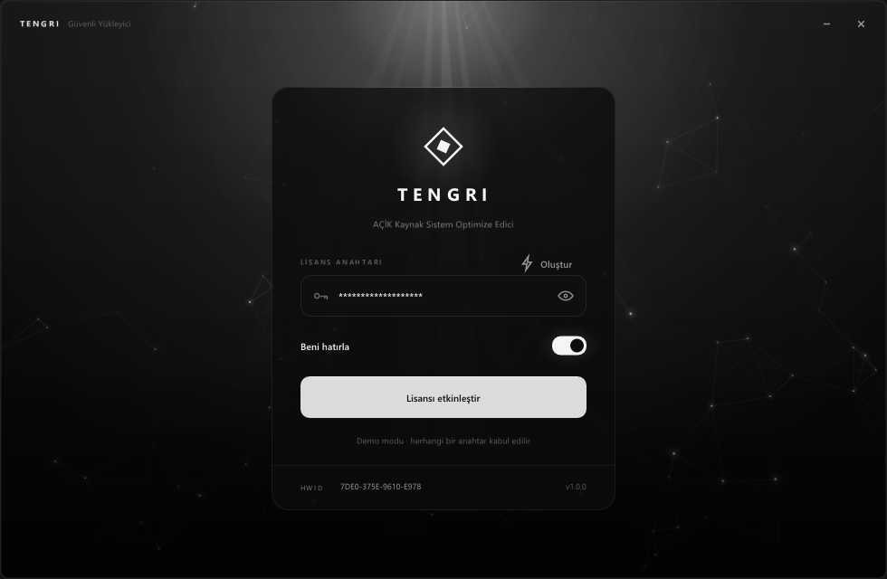
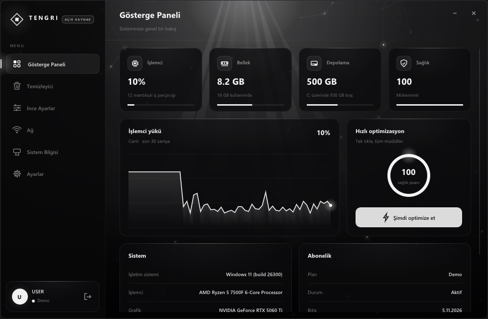
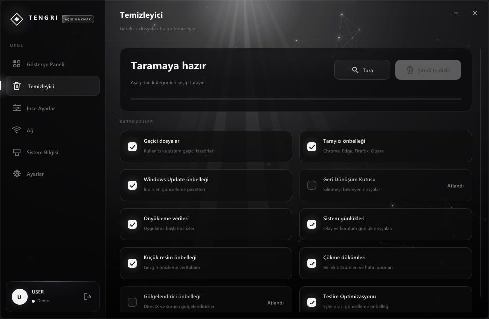
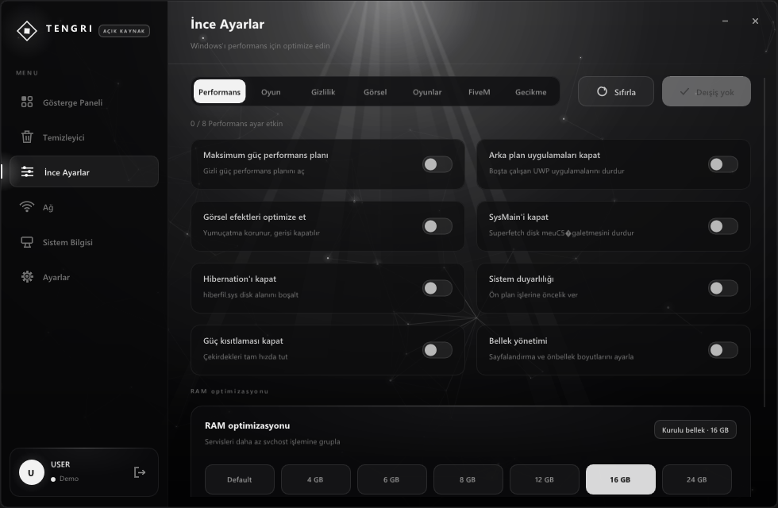
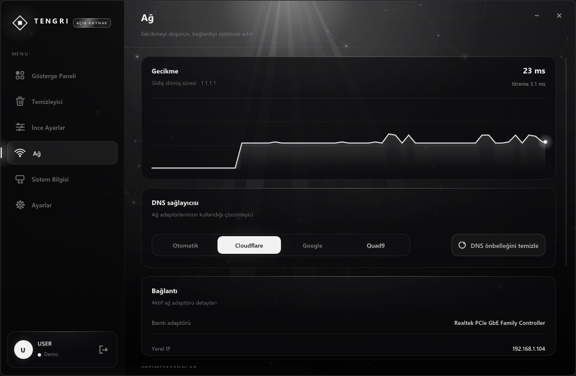
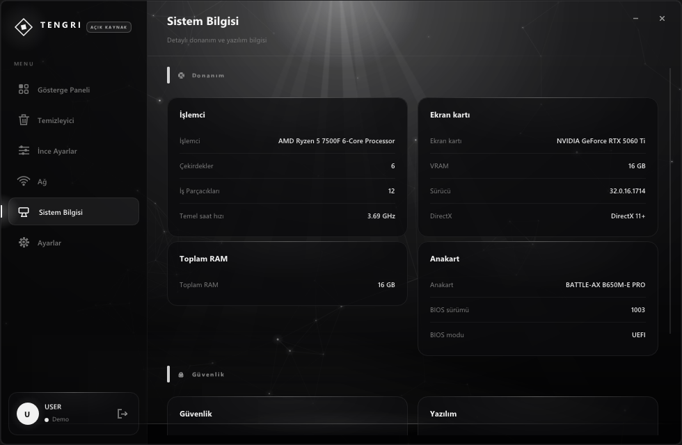
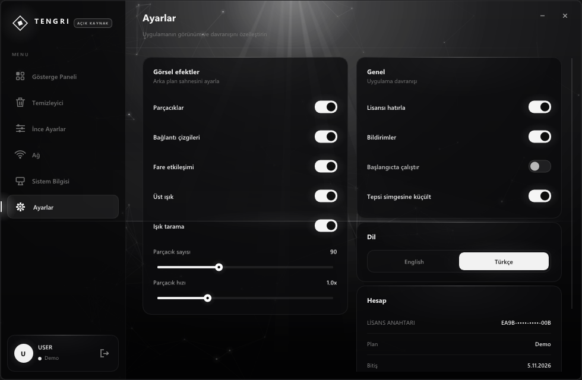
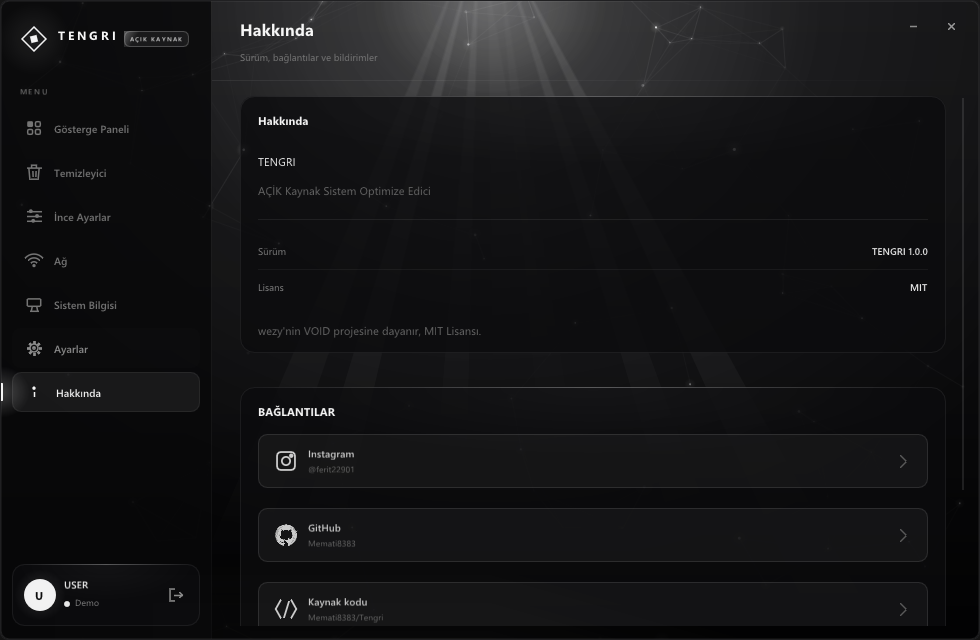

# TENGRI — Sistem Optimize Edici

C++ ile yazılmış bir Windows sistem optimize edici. .NET yok, Electron yok — tek bir
~1.4 MB yerel çalıştırılabilir dosya, DirectX 11 üzerinde çizilen kendi monokrom
arayüzüyle.

Yazdığı her registry anahtarı kaynakta görünür. İkna dosyasına güvenmek istemiyorsan
kendin derle.

> **Ayarları uygulamadan önce bir geri yükleme noktası oluştur.** Bunlar gerçek registry
> değerlerini değiştirir.

---

## Ekran görüntüleri

Giriş ekranı:



Gösterge paneli — canlı CPU / RAM / disk kullanımı, 30 saniyelik gerçek CPU yükü grafiği
ve canlı durumdan hesaplanan sağlık puanı:



Temizleyici:



İnce ayarlar:



Ağ:



Sistem bilgisi:



Ayarlar:



Hakkında:



---

## Çalıştırmadan önce

Antivirüsünüzün uyarı vermesi beklenir. TENGRI açılışta yönetici yetkisi istiyor,
`HKEY_LOCAL_MACHINE` altına yazıyor ve geçici `.reg` dosyalarını içe aktarmak için
`reg.exe` çağırıyor. Bu tam olarak bir "registry temizleyici" zararlı yazılım ailesinin
davranış imzası, bu yüzden sezgisel motorlar imzasız çalıştırılabilirleri işaretliyor.
TENGRI imzasız ve tespitler bu yüzden beklenen bir sonuç. Ayrıntı: [Yükseltme](#yükseltme).

---

## Özellikler

### Ekranlar

| Ekran | Ne yapar |
|---|---|
| **Gösterge Paneli** | Canlı sistem metrikleri, CPU geçmişi grafiği, sağlık puanı, tek tıkla optimizasyon, sistem ve abonelik özeti |
| **Temizleyici** | 10 kategoride asenkron tarama ve silme, kategori seçimi, tarama/temizleme durumu |
| **İnce Ayarlar** | 7 kategori, 56 anahtar; her anahtar başlangıçta registry'den okunur |
| **Ağ** | Gerçek ICMP gecikme ölçümü, DNS geçişi, bağlantı ayrıntıları, 6 ağ anahtarı |
| **Sistem Bilgisi** | Donanım, yazılım ve güvenlik ayrıntıları |
| **Ayarlar** | Görsel efektler, davranış, dil, hesap |
| **Hakkında** | Sürüm, lisans, uyarılar, sosyal ve kaynak kod bağlantıları |

---

### Gösterge Paneli

| Özellik | Ayrıntı |
|---|---|
| İşlemci yükü | Win32 `GetSystemTimes` üzerinden canlı, çekirdek süresinden boşta süre ayrı tutularak hesaplanır |
| Bellek | `GlobalMemoryStatusEx` ile kullanılan / toplam GB |
| Depolama | Toplam ve boş alan; sağlık puanına girer |
| Sağlık puanı | 0-100; CPU yükü, RAM baskısı ve boş diskten canlı anlık görüntüyle hesaplanır |
| CPU geçmişi | Kayan 30 saniyelik gerçek yük grafiği (rastgele yürüyüş değil) |
| Hızlı optimize et | Çalışma kümesini kırpma + DNS önbelleğini boşaltma |
| Sistem özeti | İşletim sistemi, işlemci, ekran kartı, bilgisayar, kullanıcı, çalışma süresi |
| Abonelik | Plan, durum, bitiş, HWID |

---

### Temizleyici — 10 kategori

| Kategori | Ne siler | Özel davranış |
|---|---|---|
| Geçici dosyalar | Kullanıcı ve sistem geçici klasörleri | — |
| Tarayıcı önbelleği | Chrome, Edge, Firefox, Opera, Brave | **Firefox** profil başına, yalnızca `cache2`; profil kökü (oturumlar, yer imleri, eklentiler) asla silinmez |
| Windows Update önbelleği | İndirilmiş güncelleme paketleri | `wuauserv` ve `BITS` durdurulur, yalnızca biz durdurduysak geri başlatılır |
| Geri Dönüşüm Kutusu | Silinen dosyalar | — |
| Önyükleme verileri | Prefetch | — |
| Sistem günlükleri | Olay günlükleri | — |
| Küçük resim önbelleği | Küçük resim veritabanı | — |
| Çökme dökümleri | Bellek dökümleri ve hata raporları | — |
| Gölgelendirici önbelleği | DirectX ve sürücü önbelleği | — |
| Teslim Optimizasyonu | İndirme dağıtım önbelleği | — |

| Davranış | Ayrıntı |
|---|---|
| Bağlantı güvenliği | Junction ve sembolik bağlantılar (`FILE_ATTRIBUTE_REPARSE_POINT`) yaprak sayılır, içine girilmez; bağlantı döngüsü taramayı sınırsızlaştıramaz |
| İş parçacığı | Tarama ve silme arka plan iş parçacığında, arayüzü bloklamaz |
| Kategori seçimi | Her kategori ayrı onay kutusu; yalnızca işaretlenenler taranır |
| Tutarlılık | Günlük silme seçeneği kapatıldığında tarama da aynı şekilde uygulanır |

---

### İnce Ayarlar — 7 kategori, 56 anahtar

Her anahtar başlangıçta registry'den **gerçek** durumunu okur, böylece arayüz kaydedilmiş
bir ayar dosyası değil, gerçekte uygulanan şeyi gösterir.

**Uygula** yalnızca seçili kategoriye ve yalnızca gerçekten dokunduğun anahtarlara yazar.
Dokunulmamış bir kayıt, başka bir aracın sahip olduğu bir değerin üstüne asla geri
alınmaz. İki anahtarın ortak sahiplendiği değerler (`SystemResponsiveness`,
`DisablePagingExecutive`, `GameDVR_FSEBehaviorMode`) etkin olan anahtardan yeniden
dayatılır.

#### Performans

| Anahtar | Ne yapar |
|---|---|
| Maksimum güç performans planı | Gizli güç performans planını açar |
| Arka plan uygulamalarını kapat | Boşta çalışan UWP uygulamalarını durdurur |
| Görsel efektleri optimize et | Yumuşatma korunur, geri kalanı kaldırılır |
| SysMain'i kapat | Superfetch'in disk tıkamalarını durdurur |
| Hibernation'ı kapat | `hiberfil.sys` disk alanını boşaltır |
| Sistem duyarlılığı | Ön plan işlerine öncelik verir |
| Güç kısıtlaması kapat | Çekirdekleri tam saat hızında tutar |
| Bellek yönetimi | Sayfalama ve önbellek boyutlarını ayarlar |

#### Oyun

| Anahtar | Ne yapar |
|---|---|
| Oyun modu | Oyunları kaynaklarda önceliklendirir |
| Tam ekran optimizasyonları | Tam ekran dışı modu için devre dışı bırakır |
| Donanım GPU zamanlaması | Kare zamanlaması gecikmesini düşürür |
| Game Bar'ı kapat | Katman ve DVR yakalamasını kaldırır |
| Ham fare girdisi | İşaretçi hızlandırmasını kapatır |
| Zamanlayıcı çözünürlüğü | Daha sıkı kare zamanlaması sağlar |
| CPU önceliği yükselt | Etkin oyun sürecini güçlendirir |
| Oyun modu (eski başlıklar) | Oyun modunu eski çalıştırılabilirlere uygular |

#### Gizlilik

| Anahtar | Ne yapar |
|---|---|
| Telemetriyi kapat | Tanılama verisi yüklemelerini durdurur |
| Etkinlik geçmişini kapat | Zaman çizelgesinin kaydedilmesini engeller |
| Reklam kimliğini kapat | Kişiselleştirilmiş reklam izlemeyi kaldırır |
| Konum izlemeyi kapat | Sistem genelinde konumu engeller |
| Cortana'yı kapat | Sesli asistanı kapatır |
| Geri bildirim isteklerini engelle | Asla geri bildirim istemez |
| Kişiselleştirilmiş deneyimler | Kullanım tabanlı ipuçlarını devre dışı bırakır |
| Hata raporlamayı kapat | Çökme raporlarının gönderilmesini engeller |

#### Görsel

| Anahtar | Ne yapar |
|---|---|
| Animasyonları kapat | Anında pencere geçişleri sağlar |
| Saydamlığı kapat | Düz görev çubuğu ve menüler verir |
| Klasik sağ tık menüsü | Tam sağ tık menüsünü geri getirir |
| Dosya uzantılarını göster | `.exe`, `.txt` vb. dosyaları daima gösterir |
| Gizli dosyaları göster | Gizli klasörleri ortaya çıkarır |
| Görev çubuğu aramasını gizle | Görev çubuğu alanını geri kazanır |
| Kilit ekranı ipuçlarını kapat | Kilit ekranını temizler |
| Başlangıç gecikmesini kapat | Başlangıç uygulamalarını anında başlatır |

#### Oyunlar

| Anahtar | Ne yapar |
|---|---|
| Oyun görev önceliği | GPU 8 / CPU 6 / yüksek zamanlama |
| Game DVR'ı kapat | Kayıt ve FSE kipini kapatır |
| Saat hızı | 10000 tik, arka plan sınırı yok |
| Çekirdek başına GPU DPC | Sürücü DPC'lerini çekirdeklere dağıtır |
| NVIDIA iş parçacığı önceliği | `nvlddmkm`'yi öncelik 31'e çıkarır |
| Sayfalama yürütmesini kapat | Çekirdek kodunu fiziksel bellekte tutar |
| Büyük sistem önbelleği | Dosya önbelleğini çalışma kümesine tercih eder |
| IO sayfa kilit sınırı | 1 MB kilit sınırı, daha büyük L2 ipucu |

#### FiveM

| Anahtar | Ne yapar |
|---|---|
| FiveM görev boost | FiveM için tam oyun görev profili |
| SistemResponsiveness 0 | CPU'nun %100'ünü ön plan işlerine verir |
| Ağ kısıtlamasını kapat | Paket/ms başına 10 paketlik sınırı kaldırır |
| Anlık menüler | Menüler, açılış beklemeye gerek olmadan |
| Hızlı uygulama sonlandırma | Takılan uygulama zaman aşımlarını kısaltır |
| Düşük seviye kanca zaman aşımı | 5000 ms yerine 1000 ms |
| Servis sonlandırma zaman aşımı | Servisleri daha hızlı kapatır |
| Pencere sürüklemesini kapat | Daha hafif pencere hareketi |

#### Gecikme

| Anahtar | Ne yapar |
|---|---|
| Global zamanlayıcı çözünürlüğü | 0.5 ms zamanlayıcı isteklerini kabul eder |
| DPC watchdog profili | DPC gözlet profilini gevşetir |
| İstisna zinciri doğrulaması | SEHOP zincir kontrollerini atlar |
| Kesme yönlendirme | Kesmeleri kendi çekirdeğinde tutar |
| Win32 öncelik ayrımı | 0x28 - kısa, sabit kuantumlar |
| Güvenilirlik zaman damgası | Güvenilirlik örnekleme yazılarını durdurur |
| Paylaşım ihlali beklemesi yok | Paylaşım ihlali beklemesini kaldırır |
| Fare girdi gecikmesi düzeltmesi | AAP eşiği ve özellik ayarları |

---

### Ağ

| Özellik | Ayrıntı |
|---|---|
| Gecikme ölçümü | 1.1.1.1'e gerçek ICMP tur-çevrimi, arka plan iş parçacığında; ilk örnek düşene kadar grafik "bekliyor" der |
| Jitter | Ardışık ölçümler arası değişim |
| DNS sağlayıcısı | Otomatik / Cloudflare / Google / Quad9, `netsh` üzerinden; seçimden sonra çözümleyici boşaltılır |
| DNS önbelleğini temizle | Çözümleyici önbelleğini boşaltır |
| Bağlantı ayrıntıları | Aktif adaptörün adı, yerel IP, ağ geçidi |

**Ağ anahtarları**

| Anahtar | Ne yapar | Durum |
|---|---|---|
| TCP otomatik ayarlama | En iyi alma penceresi ölçeklendirmesi | Etkin |
| Nagle algoritmasını kapat | Küçük paketler için daha düşük gecikme | Etkin |
| Ağ kısıtlama indeksi | QoS paket zamanlayıcısı | Etkin |
| QoS paket zamanlayıcı | QoS için bant genişliği çift yönlü ayarlama | Etkin |
| Büyük gönderme kapatma | Adaptörlerde LSO'yu kapatır (v4 ve v6) | Etkin |
| Kesme moderasyonu | Adaptör sürücüsüne özel, genel karşılığı yok | **Gri** — sessizce işe yaramak yerine devre dışı gösterilir |

Adaptör seçimi döngü, tünel ve sanal NIC'leri yok sayar; bağlantı adları `netsh`'e
ulaşmadan önce temizlenir.

---

### RAM optimizasyon profili

Windows'un servisleri her servis için ayrı `svchost.exe` başlatmak yerine daha az sürece
toplamasını sağlar. 14 hazır profil:

| Profil | | Profil | |
|---|---|---|---|
| Default | 0 GB | 32 GB | 32 |
| 4 GB | 4 | 64 GB | 64 |
| 6 GB | 6 | 96 GB | 96 |
| 8 GB | 8 | 128 GB | 128 |
| 12 GB | 12 | 192 GB | 192 |
| 16 GB | 16 | 256 GB | 256 |
| 24 GB | 24 | 512 GB | 512 |

| Özellik | Ayrıntı |
|---|---|
| Otomatik öneri | Kurulu RAM'e en yakın profil önerilen olarak işaretlenir |
| Varsayılana dönüş | `Default` seçilince sistemin kendi değeri geri yüklenir |
| Canlı okuma | O an yazılı olan profil registry'den okunur |

---

### Sistem Bilgisi

| Alan | Kaynak | Not |
|---|---|---|
| İşlemci | Registry / `__cpuid` | Ad, fiziksel çekirdek, mantıksal iş parçacığı, taban saat |
| Ekran kartı | DXGI + display class anahtarı | Ad, VRAM, **sürücü sürümü** (DirectX registry değerinden değil, display class anahtarından) |
| DirectX | `GetVersionEx` | Sürüm |
| Toplam RAM | `GlobalMemoryStatusEx` | — |
| Anakart | Registry | Model |
| BIOS | Registry | Sürüm, **mod (UEFI / Legacy)** |
| Güvenlik | — | **Secure Boot durumu**, **sanalleştirme durumu** (firmware / VBS / Hyper-V) |
| Diğer | Registry | Windows kurulum tarihi, ekran çözünürlüğü, sistem dili |

RAM hızı ve slot sayısı `N/A` bildirir: bu bilgiler registry'de değil SMBIOS tip 17
tablolarındadır ve görünürlüğü makul ama yanlış bir sayı, dürüst bir boşluktan kötüdür.

---

### Ayarlar

| Bölüm | Seçenek |
|---|---|
| Görsel efektler | Parçacıklar, bağlantı çizgileri, fare etkileşimi, üst ışık, ışık süpürmesi |
| Parçacık ayarları | Parçacık sayısı (kaydırıcı), parçacık hızı (çarpan) |
| Genel | Lisansı hatırla, bildirimler, başlangıçta çalıştır, tepsi simgesine küçült |
| Dil | English / Türkçe — seçim kalıcı olarak saklanır |
| Hesap | Maskelenmiş lisans anahtarı, plan, bitiş, demo lisans bildirimi, çıkış yap |

| Davranış | Ayrıntı |
|---|---|
| Başlangıçta çalıştır | Gerçek bir `HKCU\...\Run` girdisi yazar ve geri okur, böylece anahtar kayamaz |
| Tepsi simgesine küçült | Gerçek kabuk ikonu; sol tık geri getirir, sağ tık Aç / Çıkış menüsü açar. Kabuk ikonu reddederse sıradan küçültmeye düşer |
| Diller | İngilizce ve Türkçe; tüm metinler, tweak etiketleri ve sistem durumları çizim anında çözülür |
| DPI | Ölçekleme tüm boyutlarda uygulanır; monitör değişiminde yeniden ölçeklenir |

---

### Hakkında

| Öğe | İçerik |
|---|---|
| Kimlik | Ürün adı, sürüm (çalışan exe'nin sürüm kaynağından okunur), lisans |
| Bağlantılar | Instagram, GitHub ve kaynak kod — gerçek marka siluetli ikonlarla, `ShellExecuteW` ile açılır |
| Bildirimler | Demo lisans açıklaması ve yönetici yetkisi gerekçesi |

---

## Nasıl çalışıyor

Oyunlar, FiveM ve Gecikme kategorileri `src/core/regpack.cpp` içine **doğrudan gömülü
`.reg` gövdeleri** olarak gelir. Hiçbir şey indirilmez, harici klasör gerekmez. Çalışma
anında:

1. `.reg` metni rastgele adlı `%TEMP%\tengri_<pid>_<rastgele>.reg` dosyasına BOM'lu
   UTF-16LE olarak yazılır
2. Gizli pencerede `reg.exe import` ile içe aktarılır
3. Geçici dosya hemen silinir

| Konu | Ayrıntı |
|---|---|
| Geçici dosya güvenliği | `CREATE_NEW \| FILE_FLAG_OPEN_REPARSE_POINT` ve `CryptGenRandom` adı. Uygulama HKLM'ye dokunduğunda yükseltilmiş çalıştığı için tahmin edilebilir bir `%TEMP%` yolu, yerel saldırganın dosyayı önceden oluşturup bir junction'a yönlendirmesine izin verirdi |
| Neden `reg.exe` | `regedit /s` içe aktarma başarısız olsa bile 0 döndürür; bir anahtar sessizce hiçbir işe yaramaz. `reg import` gerçek bir çıkış kodu döndürür |
| Kategori başına tek geçiş | Bir kategorinin gövdeleri tek `.reg` içinde birleştirilir, böylece sekiz ayrı süreç yerine tek içe aktarma olur |
| Geri alma | Her anahtarın hem açma hem geri alma gövdesi vardır; kapatmak önceki değeri geri yükler veya anahtarı siler |

---

## Yükseltme

Manifest `requireAdministrator` istiyor, yani tüm uygulama yükseltilmiş çalışıyor.
Sebebi: Oyunlar, FiveM, Gecikme ve RAM kategorileri HKLM'ye yazıyor ve Uygula düğmesinde
başarısız olmak için yükseltmeden başlatmanın anlamı yok.

**Bu bir tercihtir ve gerçek maliyetleri vardır.** Süreç içindeki hiçbir kod yolu, bunları
yapmak için hiçbir sebebi olmayanlar dâhil, yönetici haklarıyla çalışır. Bakımını üstlenecek
geliştirici için daha iyi tasarım `asInvoker` + kullanıcı yönetici gerektiren bir
kategoride Uygula'ya bastığında `runas` ile yeniden başlatmaktır. Bu bir refactor'dır,
manifest düzenlemesi değil.

Pratik bir rahatsızlık: **çalışan bir TENGRI örneği kendi `.exe`'ini tutuyor**, üstüne
derleme yapamazsın ve yükseltilmemiş bir kabuk onu kapatamaz. Yeniden derlemeden önce
TENGRI'yi tray'den kapat.

---

## Derleme

```bat
build.bat
```

Betik Visual Studio kurulumunu bulur (`vswhere` sonuç vermediğinde dizin taramasına düşer),
kaynakları derler ve `third_party/` altındaki arayüz kütüphanesini eksikse klonlar.
Çıktı: `build\TENGRI.exe`.

CMake de çalışır:

```bat
cmake -B build
cmake --build build --config Release
```

**Gereksinimler:** Windows 10/11 x64, *Desktop development with C++* iş yükü olan Visual
Studio.

### Sürümleme ve kimlik

Tüm ürün kimliği — ad, pencere sınıfı, tray metni, `%APPDATA%` klasörü, `Run` değer adı,
geçici dosya öneki, ikon kimliği, bağlantılar — **`src/brand.hpp`** içinde. Yeniden
markalamak tek dosyalık bir düzenleme.

Sürüm numarası `res/tengri.rc` içinde bir `VERSIONINFO` kaynağı olarak duruyor ve Hakkında
sayfası ikinci bir kopya taşımak yerine `GetFileVersionInfo` ile çalışan exe'den geri
okuyor. Kod tabanında hiçbir yerde derleme tarihi gömülü değil: eskiden sürüm dizesine
gömülüyordu, yani aynı commit'in iki derlemesi farklı sürümler bildiriyordu.

`res/tengri.ico`, `tools/make_icon.ps1` ile üretiliyor; uygulamanın çalışma anında çizdiği
elmas işaretin geometrisinden çiziyor, böylece ikon ile sidebar logosu ayrışamaz.

---

## Proje yapısı

```
src/main.cpp               Kenarlıksız Win32 penceresi, D3D11 aygıtı, yuvarlatılmış köşeler
src/brand.hpp              Ürün kimliği: ad, yollar, registry anahtarları, sürüm, bağlantılar
src/app.cpp                Ekranlar, durum yönetimi, Hakkında sayfası
src/gui/theme.cpp          Renkler, fontlar, DPI ölçekleme
src/gui/fx.cpp             Parçacıklar, yıldız geçişi, üst ışık, ışık süpürme
src/gui/widgets.cpp        Buton, anahtar, onay kutusu, giriş, kaydırıcı, segment, grafik, bildirim
src/gui/icons.cpp          Vektör ikonlar
src/gui/brand_icons.cpp    Üçgenlenmiş marka siluetleri (üretilmiş)
src/core/cleaner.cpp       Dosya taraması ve silme
src/core/tweaks.cpp        7 tweak kategorisinin registry okuma/yazma işlemleri
src/core/regpack.cpp       Gömülü .reg gövdeleri + reg.exe ile içe aktarma
src/core/ram.cpp           SvcHostSplitThresholdInKB profilleri
src/core/network.cpp       DNS geçişi, adaptör bilgisi, ağ anahtarları, ICMP ölçümü
src/core/sysinfo.cpp       CPU / RAM / disk / çalışma süresi / HWID
src/core/sysinfo_detail.cpp  Secure Boot, sanallaştırma, BIOS modu, kurulum tarihi
src/core/lang.cpp          İngilizce / Türkçe metin tabloları
src/core/license.cpp       Demo lisans ekranı
src/tray.cpp               Kabuk tray ikonu
res/tengri.rc              İkon, manifest, VERSIONINFO
res/app.manifest           Yürütme düzeyi, DPI farkındalığı, işletim sistemi uyumluluğu
tools/make_icon.ps1        Uygulama ikonunu üretir
tools/make_brand_icons.ps1 Marka siluetlerini üçgenler ve brand_icons.cpp üretir
tools/shoot.ps1            Ekran görüntüsü almak için yardımcı betikler
```

### i18n tabloları

`src/core/lang.cpp` aynı uzunlukta olmalı olan iki konumsel metin tablosu tutuyor —
İngilizce ve Türkçe. C++ bunu çalışma anında zorlamıyor, bu yüzden eksik bir giriş çok
sonra tek bir ayarın yanlış etiketi olarak ortaya çıkıyor. Üç `static_assert` tabloları
`S::_COUNT`'a ve birbirine karşı kontrol ediyor, yani uyumsuzluk bir build hatası.

Blok tablosu başlangıcı sabit bir sayı değil, son düz anahtardan türetiliyor. Sabit bir
sayı bir kez kaymıştı ve her tweak etiketini sessizce kaydırmıştı; türetilmiş olması, bir
anahtar eklemenin blokları bozamaması anlamına geliyor.

---

## Notlar

- Bazı ayarların etkili olması için yeniden başlatma gerekir.
- Lisans ekranı bir **demodur**: her anahtar kabul edilir, sunucuya karşı hiçbir doğrulama
  yapılmaz ve hiçbir telemetri yoktur. Hem Hakkında sayfası hem de Hesap kartı bunu
  söyler.
- Makine parmak izi, bilgisayar adı, sistem birim seri numarası ve bir **ürüne özgü tuz**
  üzerinden FNV-1a özeti olarak hesaplanır. Hiçbir yere gönderilmez.

## Lisans

[MIT](LICENSE)