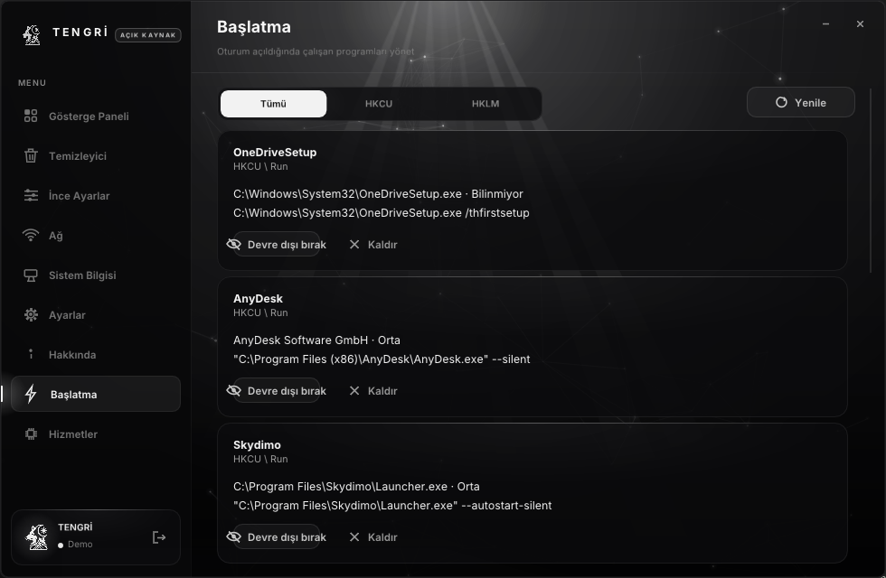
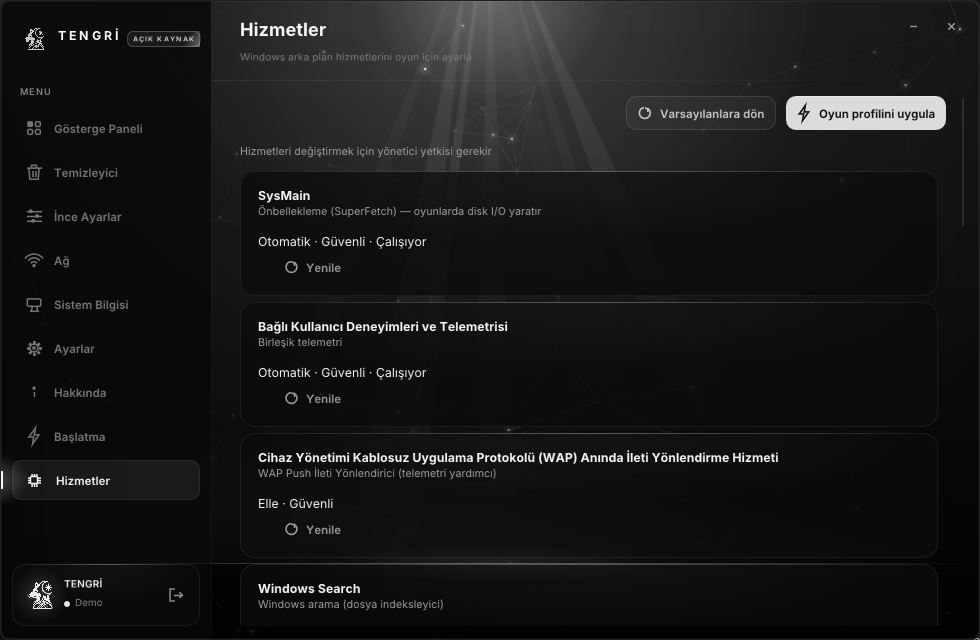

# TENGRİ — Sistem Optimize Edici

<p align="center">
  <a href="LICENSE"></a>
  
  
  
  
  
  
  
  <a href="https://github.com/Memati8383/Tengri/releases"></a>
</p>

C++ ile yazılmış bir Windows sistem optimize edici. .NET yok, Electron yok, çalışma
zamanı yok — tek bir 1.7 MB yerel çalıştırılabilir dosya, DirectX 11 üzerinde çizilen
kendi monokrom arayüzüyle.

Rozetlerin tamamı bu depodan türetilir (son biri hariç — o GitHub'daki en yeni etiketi
okur): boyut derlenmiş `build\TENGRI.exe`'nin gerçek boyutu; denetim sayısı
`build.bat`'ın çalıştırdığı beş test paketinin toplamı; anahtar sayısı
`tools\make_tweak_table.ps1`'ın saydığı değer. Kaynak değiştiğinde rakam da değişmek
zorunda — rozetler süs değil kontrol noktası.

<div align="center">
  
</div>

<p align="center">
  <b>9 ekran</b> · <b>56 registry anahtarı</b> · <b>10 temizlik kategorisi</b> ·
  <b>14 RAM profili</b> · <b>2 dil</b> · <b>0 telemetri</b> · <b>2 ağ çıkışı, hepsi listede</b>
</p>

Yazdığı her registry anahtarı kaynakta görünür: 56 anahtarın dokunduğu her yol
[docs/tweaks-registry.md](docs/tweaks-registry.md) içinde liste halinde. Bu tablo kaynaktan üretilir,
elle yazılmaz. İkna dosyasına güvenmek istemiyorsan kendin derle.

<details>
<summary><b>İçindekiler</b></summary>

- [Gereksinimler](#gereksinimler)
- [Kapsam dışılar](#kapsam-dışılar)
- [Geri alma](#geri-alma)
- [İndir](#indir)
- [Kaynaktan derle](#kaynaktan-derle)
- [Ekran görüntüleri](#ekran-görüntüleri)
- [Çalıştırmadan önce](#çalıştırmadan-önce)
- [Özellikler](#özellikler) — 9 ekran, tek tek
- [Testler](#testler) — 5 paket, 374 denetim
- [Nasıl çalışıyor](#nasıl-çalışıyor)
- [Ağ kullanımı](#ağ-kullanımı) — dışarı giden üç isteğin tam listesi
- [Yükseltme](#yükseltme)
- [Derleme](#derleme)
- [Sürümleme ve kimlik](#sürümleme-ve-kimlik)
- [Proje yapısı](#proje-yapısı)
- [Notlar](#notlar)
- [Sürüm etiketi ve yayın](#sürüm-etiketi-ve-yayın)
- [Lisans](#lisans)

</details>

## Gereksinimler

| | |
|---|---|
| İşletim sistemi | Windows 10 ve Windows 11 (x64) |
| Mimari | 64-bit |
| Disk | 1.7 MB — Releases'taki `TENGRI.exe` (v1.3.0, CI derlemesi) 1.739.264 bayt, yerel derleme 1.750.528 bayt (araç seti yamasına göre birkaç KB oynar) |
| Ek bağımlılık | Yok — .NET, Python veya çalışma zamanı gerekmez |
| Yönetici | Yalnızca ayar uygularken gerekir; açılışta gerekmez |

Windows 10 1809'dan eskisi desteklenmiyor. Bazı anahtarlar (`HwSchMode`,
`PowerThrottling`) yalnızca Windows 10 1903 ve sonrasında vardır; daha eski bir sürümde
açılıp kapatılsa bile etkisi görünmez.

## Kapsam dışılar

Bu birkaç şeyi **yapmaz**, ve yapmadığını açıkça söylemek bu aracın bir parçası:

- **Antivirüsü, güvenliği veya Windows güncellemesini değiştirmez.** Tek bir antivirüs
  ya da güvenlik özelliğini kapatmaz, hiçbir dosyayı karantinaya almaz.
- **Telemetri göndermez.** Lisans ekranı bir demodur; sunucuya hiçbir istek yapılmaz.
  Makine parmak izi hesaplanır ama hiçbir yere gönderilmez. Dışarı giden tek istek
  sürüm denetimidir ve o da hiçbir şey taşımaz — bkz. [Ağ kullanımı](#ağ-kullanımı).
- **Kendiliğinden güncellenmez.** İndirme sen "İndir" demeden başlamaz, kurulum ayrıca
  "Kur ve yeniden başlat" ister. Uygulama kapalıyken hiçbir şey inmez, hiçbir şey
  yazılmaz. Denetimin kendisi de Ayarlar → Güncellemeler altından tamamen kapatılabilir.
  (İlk çalıştırmada tek seferlik iki kayıt yazılır — bkz. [Windows bildirimleri](#windows-bildirimleri).)
- **Kullanıcı verisini okumaz.** Yalnızca [registry tablosunda](docs/tweaks-registry.md)
  listelenen anahtarlara yazar, temizleyicide de yalnızca kendi kategorilerinin saydığı
  geçici dosyaları siler.
- **Arka planda sessizce çalışmaz.** Ayar ancak sen "Uygula" dediğinde yazılır.

## Geri alma

Ayarlar gerçek registry değerlerini değiştirir. Üç ayrı geri dönüş katmanı var:

**1. Aracın kendi yedeği.** "Uygula" düğmesine bastığında dokunulacak registry
anahtarları **önce** dışa aktarılır, tarih damgalı bir klasöre:

```
%LOCALAPPDATA%\TENGRI\backups\YYYYAAGG-SS-DDSS\
```

Sonrasında İnce Ayarlar sayfasındaki **Geri al** düğmesi bu yedeği geri içe aktarır.
Yedekleme yalnızca okuma yaptığı için UAC istemez; geri alma yazdığı için UAC ister.

Yedekler birikmez, her uygulamada yeni bir klasör açılır. Temizlemek istersen
`%LOCALAPPDATA%\TENGRI\backups` klasörünü silmen yeterli.

> **Neden önemli:** "Kapat" işlemi senin değerini geri yüklemez, kodlanmış varsayılanı
> geri yükler. Özelleştirdiğin bir değer varsa yedek olmadan kaybolur. Yedek tam olarak
> "uygulamadan önce ne vardı" halini saklar.

**2. Geri alınabilir tasarım.** Bazı ekranlar yedek klasörüne hiç ihtiyaç duymaz, çünkü
yazdıkları şey kendi tersini taşıyor:

| Ekran | Ne yapar | Nasıl geri alınır |
|---|---|---|
| Başlatma | Değeri silmek yerine `HKCU\Software\TENGRI\StartupDisabled\<kapsam>` anahtarına taşır | Aynı düğmeyi tekrar açmak — değeri eski yerine yazar |
| Hizmetler | Değişiklikten önce mevcut başlangıç türünü ve `DelayedAutostart` bayrağını `HKLM\SOFTWARE\TENGRI\ServicesBackup\<hizmet>` altına yazar | **Varsayılanlara dön** düğmesi yedekten geri okur |

Bu iki yolda "geri al" bir veri kaybı yarışına değil, tek bir kayda bakıyor. Yine de
registry'ye yazıldığı için HKLM satırlarında UAC istenir.

**3. Windows geri yükleme noktası.** Araç yalnızca kendi dokunduğu anahtarları saklar.
Sistemde yapacağın başka değişiklikler için ayrıca bir nokta oluştur:
`Windows + R` → `sysdm.cpl` → **Sistem koruma** → **Oluştur**.

Üç yol birbirinin yerine geçmez; ilk ikisi aracın kendi yazdıklarını, üçüncüsü tüm
sistemi geri getirir.

## İndir

Hazır derlemeler [Releases](https://github.com/Memati8383/Tengri/releases) sayfasında.
Kurulum gerekmez, `TENGRI.exe` dosyasını çalıştırman yeterli.

Antivirüs uyarısı alırsan normaldir ve nedeni [SECURITY.md](SECURITY.md)'de açıklanıyor.

Yeni sürüm çıktığında uygulama bunu kendisi söyler: Ayarlar → **Güncellemeler** kartında
**İndir**, sonra **Kur ve yeniden başlat**. İndirme sen onaylamadan başlamaz. Ayrıntı:
[Ağ kullanımı](#ağ-kullanımı).

## Kaynaktan derle

```bat
git clone --recurse-submodules https://github.com/Memati8383/Tengri.git
cd Tengri
build.bat
```

`build.bat` üretici betikleri, derlemeyi ve **beş test paketini** tek geçişte çalıştırır;
testlerden biri takılırsa betik hata koduyla çıkar. Alt modülü unutursan betik ImGui'yi
kendisi klonlar ve sürümünü denetler. Ayrıntı: [Derleme](#derleme).

### Yazı tipi

Arayüz **Inter** kullanır. Uygulamanın gerçekten çizdiği karakterlere (Basic Latin +
Türkçe + noktalama) göre alt kümelenmiş hâli `res/fonts` altında durur, üç ağırlık
toplam 75 KB'dır ve exe içine gömülür — yani font dosyası yanında olmadan da arayüz
doğru çizilir.

Inter, SIL Open Font License 1.1 ile lisanslıdır; tam metin
[`res/fonts/Inter-OFL.txt`](res/fonts/Inter-OFL.txt) içinde. Alt kümeleri
yeniden üretmek için:

```bat
python -m pip install fonttools
.\tools\make_font_subset.ps1 -Archive <Inter-*.zip>
.\tools\make_font_data.ps1
```

Yazı tipi değişikliklerinde tipografi ölçeği `src/gui/theme.hpp` içindedir
(`theme::size`, `theme::track`, `theme::ink`). Çağrı yerlerinde sayı yazma.

---

## Ekran görüntüleri

Giriş ekranı:


Gösterge paneli — canlı CPU / RAM / disk kullanımı, 30 saniyelik gerçek CPU yükü grafiği
ve canlı durumdan hesaplanan sağlık puanı:


Temizleyici:


İnce ayarlar:


Ağ:


Sistem bilgisi:


Ayarlar:


Hakkında:


Başlatma:



Hizmetler:



> Dokuz görselin tamamı `tools\capture_all.ps1` ile **tek oturumda**, aynı tema ve
> aynı DPI ile üretildi. Betiği çalıştırırsan görseller bu dizine yeniden düşer.
> Görseller gerçek bir makinede alındı: Başlatma ekranı o sistemde kurulu
> programları, Hizmetler ekranı gerçek hizmet durumlarını gösterir.

---

## Çalıştırmadan önce

Antivirüsünüzün uyarı vermesi beklenir. TENGRİ `HKEY_LOCAL_MACHINE` altına yazıyor ve
geçici `.reg` dosyalarını içe aktarmak için `reg.exe` çağırıyor. Bu tam olarak bir "registry temizleyici" zararlı yazılım ailesinin
davranış imzası, bu yüzden sezgisel motorlar imzasız çalıştırılabilirleri işaretliyor.
TENGRİ imzasız ve tespitler bu yüzden beklenen bir sonuç. Ayrıntı:
[SECURITY.md](SECURITY.md) ve [Yükseltme](#yükseltme).

Ayar uygularken yönetici yetkisi istenir, ancak uygulamayı açarken ve sistem bilgisi
okurken **hiç sorulmaz**. Ayrıntı: [Yükseltme](#yükseltme).

---

## Özellikler

### Ekranlar

| Ekran | Ne yapar |
|---|---|
| **Gösterge Paneli** | Canlı sistem metrikleri, CPU geçmişi grafiği, sağlık puanı, tek tıkla optimizasyon, sistem ve abonelik özeti |
| **Temizleyici** | 10 kategoride asenkron tarama ve silme, kategori seçimi, tarama/temizleme durumu |
| **İnce Ayarlar** | 7 kategori, 56 anahtar; her anahtar başlangıçta registry'den okunur |
| **Ağ** | Gerçek ICMP gecikme ölçümü, DNS geçişi, bağlantı ayrıntıları, 6 ağ anahtarı |
| **Sistem Bilgisi** | Donanım, yazılım ve güvenlik ayrıntıları |
| **Ayarlar** | Görsel efektler, davranış, dil, hesap, bildirimler |
| **Hakkında** | Sürüm, lisans, uyarılar, sosyal ve kaynak kod bağlantıları |
| **Başlatma** | Otomatik başlayan programlar; değeri silmeden devre dışı bırakma |
| **Hizmetler** | Beyaz listedeki Windows arka plan hizmetleri için başlangıç türü ve oyun profili |

---

### Gösterge Paneli

| Özellik | Ayrıntı |
|---|---|
| İşlemci yükü | Win32 `GetSystemTimes` üzerinden canlı, çekirdek süresinden boşta süre ayrı tutularak hesaplanır |
| Bellek | `GlobalMemoryStatusEx` ile kullanılan / toplam GB |
| Depolama | Toplam ve boş alan; sağlık puanına girer |
| Sağlık puanı | 0-100; CPU yükü, RAM baskısı ve boş diskten canlı anlık görüntüyle hesaplanır |
| CPU geçmişi | Kayan 30 saniyelik gerçek yük grafiği (rastgele yürüyüş değil) |
| Hızlı optimize et | Çalışma kümesini kırpma + DNS önbelleğini boşaltma |
| Sistem özeti | İşletim sistemi, işlemci, ekran kartı, bilgisayar, kullanıcı, çalışma süresi |
| Abonelik | Plan, durum, bitiş, HWID |

---

### Temizleyici — 10 kategori

| Kategori | Ne siler | Özel davranış |
|---|---|---|
| Geçici dosyalar | Kullanıcı ve sistem geçici klasörleri | — |
| Tarayıcı önbelleği | Chrome, Edge, Firefox, Opera, Brave | **Firefox** profil başına, yalnızca `cache2`; profil kökü (oturumlar, yer imleri, eklentiler) asla silinmez |
| Windows Update önbelleği | İndirilmiş güncelleme paketleri | `wuauserv` ve `BITS` durdurulur, yalnızca biz durdurduysak geri başlatılır |
| Geri Dönüşüm Kutusu | Silinen dosyalar | — |
| Önyükleme verileri | Prefetch | — |
| Sistem günlükleri | Olay günlükleri | — |
| Küçük resim önbelleği | Küçük resim veritabanı | — |
| Çökme dökümleri | Bellek dökümleri ve hata raporları | — |
| Gölgelendirici önbelleği | `%LOCALAPPDATA%\D3DSCache`, `NVIDIA\DXCache·GLCache·NV_Cache`, `AMD\DxCache·GLCache·VkCache`, `Intel\ShaderCache` | Varsayılan tarama sürücü klasörleriyle sınırlı; **Steam** shader önbelleği aynı listede durur ama varsayılan kombinasyona dahil değildir — açık onay olmadan sayılmaz ve silinmez |
| Teslim Optimizasyonu | İndirme dağıtım önbelleği | — |

| Davranış | Ayrıntı |
|---|---|
| Bağlantı güvenliği | Junction ve sembolik bağlantılar (`FILE_ATTRIBUTE_REPARSE_POINT`) yaprak sayılır, içine girilmez; bağlantı döngüsü taramayı sınırsızlaştıramaz |
| İş parçacığı | Tarama ve silme arka plan iş parçacığında, arayüzü bloklamaz |
| Kategori seçimi | Her kategori ayrı onay kutusu; yalnızca işaretlenenler taranır |
| Tutarlılık | Günlük silme seçeneği kapatıldığında tarama da aynı şekilde uygulanır |

---

### İnce Ayarlar — 7 kategori, 56 anahtar

Her anahtar başlangıçta registry'den **gerçek** durumunu okur, böylece arayüz kaydedilmiş
bir ayar dosyası değil, gerçekte uygulanan şeyi gösterir.

**Uygula** yalnızca seçili kategoriye ve yalnızca gerçekten dokunduğun anahtarlara yazar.
Dokunulmamış bir kayıt, başka bir aracın sahip olduğu bir değerin üstüne asla geri
alınmaz. İki anahtarın ortak sahiplendiği değerler etkin olan anahtardan yeniden
dayatılır.

**Yazmadan önce yedek alınır.** Düğmeye bastığında dokunulacak anahtarlar
`%LOCALAPPDATA%\TENGRI\backups` altına `reg export` ile dışa aktarılır; sayfadaki
**Geri al** düğmesi bunu geri içe aktarır. Ayrıntı için [Geri alma](#geri-alma).

#### Performans

| Anahtar | Ne yapar |
|---|---|
| Maksimum güç performans planı | Gizli güç performans planını açar |
| Arka plan uygulamalarını kapat | Boşta çalışan UWP uygulamalarını durdurur |
| Görsel efektleri optimize et | Yumuşatma korunur, geri kalanı kaldırılır |
| SysMain'i kapat | Superfetch'in disk tıkamalarını durdurur |
| Hibernation'ı kapat | `hiberfil.sys` disk alanını boşaltır |
| Sistem duyarlılığı | Ön plan işlerine öncelik verir |
| Güç kısıtlaması kapat | Çekirdekleri tam saat hızında tutar |
| Bellek yönetimi | Sayfalama ve önbellek boyutlarını ayarlar |

#### Oyun

| Anahtar | Ne yapar |
|---|---|
| Oyun modu | Oyunları kaynaklarda önceliklendirir |
| Tam ekran optimizasyonları | Tam ekran dışı modu için devre dışı bırakır |
| Donanım GPU zamanlaması | Kare zamanlaması gecikmesini düşürür |
| Game Bar'ı kapat | Katman ve DVR yakalamasını kaldırır |
| Ham fare girdisi | İşaretçi hızlandırmasını kapatır |
| Zamanlayıcı çözünürlüğü | Daha sıkı kare zamanlaması sağlar |
| CPU önceliği yükselt | Etkin oyun sürecini güçlendirir |
| Oyun modu (eski başlıklar) | Oyun modunu eski çalıştırılabilirlere uygular |

#### Gizlilik

| Anahtar | Ne yapar |
|---|---|
| Telemetriyi kapat | Tanılama verisi yüklemelerini durdurur |
| Etkinlik geçmişini kapat | Zaman çizelgesinin kaydedilmesini engeller |
| Reklam kimliğini kapat | Kişiselleştirilmiş reklam izlemeyi kaldırır |
| Konum izlemeyi kapat | Sistem genelinde konumu engeller |
| Cortana'yı kapat | Sesli asistanı kapatır |
| Geri bildirim isteklerini engelle | Asla geri bildirim istemez |
| Kişiselleştirilmiş deneyimler | Kullanım tabanlı ipuçlarını devre dışı bırakır |
| Hata raporlamayı kapat | Çökme raporlarının gönderilmesini engeller |

#### Görsel

| Anahtar | Ne yapar |
|---|---|
| Animasyonları kapat | Anında pencere geçişleri sağlar |
| Saydamlığı kapat | Düz görev çubuğu ve menüler verir |
| Klasik sağ tık menüsü | Tam sağ tık menüsünü geri getirir |
| Dosya uzantılarını göster | `.exe`, `.txt` vb. dosyaları daima gösterir |
| Gizli dosyaları göster | Gizli klasörleri ortaya çıkarır |
| Görev çubuğu aramasını gizle | Görev çubuğu alanını geri kazanır |
| Kilit ekranı ipuçlarını kapat | Kilit ekranını temizler |
| Başlangıç gecikmesini kapat | Başlangıç uygulamalarını anında başlatır |

#### Oyunlar

| Anahtar | Ne yapar |
|---|---|
| Oyun görev önceliği | GPU 8 / CPU 6 / yüksek zamanlama |
| Game DVR'ı kapat | Kayıt ve FSE kipini kapatır |
| Saat hızı | 10000 tik, arka plan sınırı yok |
| Çekirdek başına GPU DPC | Sürücü DPC'lerini çekirdeklere dağıtır |
| NVIDIA iş parçacığı önceliği | `nvlddmkm`'yi öncelik 31'e çıkarır |
| Sayfalama yürütmesini kapat | Çekirdek kodunu fiziksel bellekte tutar |
| Büyük sistem önbelleği | Dosya önbelleğini çalışma kümesine tercih eder |
| IO sayfa kilit sınırı | 1 MB kilit sınırı, daha büyük L2 ipucu |

#### FiveM

| Anahtar | Ne yapar |
|---|---|
| FiveM görev boost | FiveM için tam oyun görev profili |
| SistemResponsiveness 0 | CPU'nun %100'ünü ön plan işlerine verir |
| Ağ kısıtlamasını kapat | Paket/ms başına 10 paketlik sınırı kaldırır |
| Anlık menüler | Menüler, açılış beklemeye gerek olmadan |
| Hızlı uygulama sonlandırma | Takılan uygulama zaman aşımlarını kısaltır |
| Düşük seviye kanca zaman aşımı | 5000 ms yerine 1000 ms |
| Servis sonlandırma zaman aşımı | Servisleri daha hızlı kapatır |
| Pencere sürüklemesini kapat | Daha hafif pencere hareketi |

#### Gecikme

| Anahtar | Ne yapar |
|---|---|
| Global zamanlayıcı çözünürlüğü | 0.5 ms zamanlayıcı isteklerini kabul eder |
| DPC watchdog profili | DPC gözlet profilini gevşetir |
| İstisna zinciri doğrulaması | SEHOP zincir kontrollerini atlar |
| Kesme yönlendirme | Kesmeleri kendi çekirdeğinde tutar |
| Win32 öncelik ayrımı | 0x28 - kısa, sabit kuantumlar |
| Güvenilirlik zaman damgası | Güvenilirlik örnekleme yazılarını durdurur |
| Paylaşım ihlali beklemesi yok | Paylaşım ihlali beklemesini kaldırır |
| Fare girdi gecikmesi düzeltmesi | AAP eşiği ve özellik ayarları |

---

### Ağ

| Özellik | Ayrıntı |
|---|---|
| Gecikme ölçümü | 1.1.1.1'e gerçek ICMP tur-çevrimi, arka plan iş parçacığında; ilk örnek düşene kadar grafik "bekliyor" der |
| Jitter | Ardışık ölçümler arası değişim |
| DNS sağlayıcısı | Otomatik / Cloudflare / Google / Quad9, `netsh` üzerinden; seçimden sonra çözümleyici boşaltılır |
| DNS önbelleğini temizle | Çözümleyici önbelleğini boşaltır |
| Bağlantı ayrıntıları | Aktif adaptörün adı, yerel IP, ağ geçidi |

**Ağ anahtarları**

| Anahtar | Ne yapar | Durum |
|---|---|---|
| TCP otomatik ayarlama | En iyi alma penceresi ölçeklendirmesi | Etkin |
| Nagle algoritmasını kapat | Küçük paketler için daha düşük gecikme | Etkin |
| Ağ kısıtlama indeksi | QoS paket zamanlayıcısı | Etkin |
| QoS paket zamanlayıcı | QoS için bant genişliği çift yönlü ayarlama | Etkin |
| Büyük gönderme kapatma | Adaptörlerde LSO'yu kapatır (v4 ve v6) | Etkin |
| Kesme moderasyonu | Adaptör sürücüsüne özel, genel karşılığı yok | **Gri** — sessizce işe yaramak yerine devre dışı gösterilir |

Adaptör seçimi döngü, tünel ve sanal NIC'leri yok sayar; bağlantı adları `netsh`'e
ulaşmadan önce temizlenir.

---

### Başlatma

Windows'un otomatik başlatma mekanizmaları çok sayıdadır (zamanlanmış görevler,
hizmetler, WMI tetikleyicileri, kabuk klasörleri). Bu ekran aşamada **en yaygın
olanı** yönetir ve yalnızca dört anahtarı okur:

| Kapsam | Anahtar | Yazma yetkisi |
|---|---|---|
| HKCU · Run | `Software\Microsoft\Windows\CurrentVersion\Run` | **istemez** |
| HKCU · RunOnce | `Software\Microsoft\Windows\CurrentVersion\RunOnce` | **istemez** |
| HKLM · Run | `Software\Microsoft\Windows\CurrentVersion\Run` | ister |
| HKLM · RunOnce | `Software\Microsoft\Windows\CurrentVersion\RunOnce` | ister |

| Davranış | Ayrıntı |
|---|---|
| Devre dışı bırakma | Değer **silinmez**, `HKCU\Software\TENGRI\StartupDisabled\<kapsam>` anahtarına **taşınır**. Açıp kapamak gerçek bir ters işlemdir; kullanıcının kendi değeri kaybolmaz |
| Neden `StartupApproved` değil | Windows'un kendi devre dışı bırakma anahtarı sürümden sürüme anlambilim değiştiriyor ve üçüncü parti araçlarla çarpışma riski taşıyor. Kendi anahtarımız bu riski hiç taşımaz |
| Silme | Ayrı bir düğme, gerçek `RegDeleteValue`. Taşımaktan farklı bir eylem olduğu için arayüzde de ayrı durur |
| Yedeklerin yeri | Bilinçli olarak yalnızca HKCU'da: HKLM'e yedek yazmak her yazmada UAC istemek anlamına gelirdi |
| Kendi kaydı | Uygulamanın `Run` girdisi listede **"TENGRİ otobaşlatma"** olarak görünür ama **silme düğmesi kilitlidir** — kendi kendini kaldıramaz. Açıp kapatmak Ayarlar ekranından yapılır, iki yerin ayrışmaması için |
| Satır içeriği | Ad + kapsam, altında yayıncı (`VERSIONINFO` şirket adı; yoksa çözülen yol), etki ve komut satırı |
| Etki tahmini | Hedef dosyanın disk boyutundan sezgisel (Düşük <2 MB, Orta <20 MB, Yüksek ≥20 MB, okunamazsa Bilinmiyor). Kesin bir ölçüm değil, bir sıralama ipucu |
| Filtre | Tümü / HKCU / HKLM; her işlemden sonra liste baştan taranır, kayan index üzerinden yanlış satıra dokunulmaz |
| Yetki yoksa | HKLM yazması sessizce başarısız olmaz — uyarı bildirimi gösterilir, arayüzü değişmiş gibi yapmaz |

---

### Hizmetler

Oturumda disk I/O, bellek ve CPU çalan arka plan hizmetleri için **başlangıç türü**
yönetimi. Hizmetler **durdurulmaz** — durdurma anlıktır ve bir sonraki oturumda
unutulur; başlangıç türü değişikliği kalıcıdır ve "oyun profili" ile "varsayılan
profil" arasında tekrarlanabilir geçişe izin verir.

| | |
|---|---|
| Kapsam | Kodda sabit **16 hizmetlik beyaz liste** |
| Liste dışı ad | Arayüzde serbest hizmet adı girilemez; `SetStartType` liste dışını reddeder |
| Kritik hizmetler | `RpcSs`, `Dhcp`, `LanmanServer`, `Winlogon` vb. **kasıtlı olarak yoktur** ve çalışma zamanında ada eşleştirilemez |
| Uyarı seviyesi | Her satırda **Güvenli** / **Dikkat** / **Riskli** etiketi çizilir (ör. `SysMain` Güvenli, `WSearch` Dikkat — arama kaybı, `PrintNotify` Riskli) |
| Oyun profili hedefi | Telemetri ve benzeri `Devre dışı`; ilk ihtiyaçta kendiliğinden başlatılabilenler **Elle** (`Disabled` yerine `Manual` tercih edilir, böylece özellik tamamen ölmez) |
| Profil öncesi yedeği | Mevcut başlangıç türü + `DelayedAutostart` bayrağı `HKLM\SOFTWARE\TENGRI\ServicesBackup\<hizmet>` altına yazılır; yalnızca **gerçekten değişecekse** yedeklenir |
| Profil düğmeleri | **Oyun profilini uygula** ve **Varsayılanlara dön**; değişen hizmet sayısı bildirimde söylenir. **Varsayılanlara dön** yedekten geri okur; hedef zaten istenen türdeyse hizmete hiç dokunulmaz |
| Yetki | Okuma (durum + tür) yükseltmeden çalışır; yazma yükseltilmiş süreç ister (`SC_MANAGER_CONNECT` + `SERVICE_CHANGE_CONFIG`). Yetki yoksa liste yine çizilir ve sayfa üstte gerekçesini söyler |

Liste: `SysMain`, `DiagTrack`, `dmwappushservice`, `WSearch`, `XblGameSave`,
`XblAuthManager`, `XboxGipSvc`, `XboxNetApiSvc`, `WbioSrvc`, `MapsBroker`,
`RetailDemo`, `RemoteRegistry`, `Fax`, `PrintNotify`, `WerSvc`, `DoSvc`.

---

### RAM optimizasyon profili

Windows'un servisleri her servis için ayrı `svchost.exe` başlatmak yerine daha az sürece
toplamasını sağlar. 14 hazır profil:

| Profil | | Profil | |
|---|---|---|---|
| Default | 0 GB | 32 GB | 32 |
| 4 GB | 4 | 64 GB | 64 |
| 6 GB | 6 | 96 GB | 96 |
| 8 GB | 8 | 128 GB | 128 |
| 12 GB | 12 | 192 GB | 192 |
| 16 GB | 16 | 256 GB | 256 |
| 24 GB | 24 | 512 GB | 512 |

| Özellik | Ayrıntı |
|---|---|
| Otomatik öneri | Kurulu RAM'e en yakın profil önerilen olarak işaretlenir |
| Varsayılana dönüş | `Default` seçilince sistemin kendi değeri geri yüklenir |
| Canlı okuma | O an yazılı olan profil registry'den okunur |

---

### Sistem Bilgisi

| Alan | Kaynak | Not |
|---|---|---|
| İşlemci | Registry / `__cpuid` | Ad, fiziksel çekirdek, mantıksal iş parçacığı, taban saat |
| Ekran kartı | DXGI + display class anahtarı | Ad, VRAM, **sürücü sürümü** (DirectX registry değerinden değil, display class anahtarından) |
| DirectX | `GetVersionEx` | Sürüm |
| Toplam RAM | `GlobalMemoryStatusEx` | — |
| RAM hızı | WMI `Win32_PhysicalMemory` | `6000 MHz (JEDEC 4800 MHz)` — çalışma hızı ile JEDEC eşleşmiyorsa ikisi de |
| RAM yuvaları | WMI `Win32_PhysicalMemory` | Dolu yuva sayısı, ör. `1 dolu` |
| Anakart | Registry | Model |
| BIOS | Registry | Sürüm, **mod (UEFI / Legacy)** |
| TPM | WMI `Win32_Tpm` | Yalnızca WMI gerçekten satır döndürürse çizilir (aşağıya bakın) |
| Güvenlik | — | **Secure Boot durumu**, **sanalleştirme durumu** (firmware / VBS / Hyper-V) |
| Diğer | Registry | Windows kurulum tarihi, ekran çözünürlüğü, sistem dili |

Sorgular arka iş parçacığında koşar; panel açılırken beklemez. Değer henüz
gelmemişse satır **hiç çizilmez** — `N/A` gösterilmez, çünkü henüz bilinmeyen
bir şey "yok" demek değildir.

**TPM satırı çoğu zaman yok.** `Win32_Tpm` yalnızca TPM'si WMI'ye tanıtılmış
makinelerde satır döndürür; BIOS'un TPM'yi açsa bile olmayabilir. Satır ancak
veri varsa çizildiği için bu, hatadan çok dürüst bir davranış.

**VRAM neden DXGI ile okunuyor.** WMI'nin `AdapterRAM` alanı 32 bit bir tam
sayı; 4 GB üstü kartlarda taşıyor ve 16 GB'lık bir kartı 4 GB gösteriyordu.


---

### Ayarlar

| Bölüm | Seçenek |
|---|---|
| Görsel efektler | Parçacıklar, bağlantı çizgileri, fare etkileşimi, üst ışık, ışık süpürmesi |
| Parçacık ayarları | Parçacık sayısı (kaydırıcı), parçacık hızı (çarpan) |
| Güncellemeler | Otomatik denetim anahtarı, son denetim durumu, **Şimdi denetle / İndir / Kur ve yeniden başlat / Vazgeç** — ayrıntı aşağıda |
| Genel | Lisansı hatırla, uygulama içi bildirimler, Windows bildirimleri, sadece hatalar, başlangıçta çalıştır, tepsi simgesine küçült, kapatınca arka planda çalışmaya devam et |
| Dil | English / Türkçe — seçim kalıcı olarak saklanır |
| Hesap | Maskelenmiş lisans anahtarı, plan, bitiş, demo lisans bildirimi, çıkış yap |

| Davranış | Ayrıntı |
|---|---|
| Başlangıçta çalıştır | Gerçek bir `HKCU\...\Run` girdisi yazar ve geri okur, böylece anahtar kayamaz |
| Tepsi simgesine küçült | Gerçek kabuk ikonu; sol tık geri getirir, sağ tık menü açar (aşağıya bakın). Kabuk ikonu reddederse sıradan küçültmeye düşer. **İlk küçültmede bir kez balon** çıkar (aşağıya bakın) |
| Kapatınca arka planda çalışmaya devam et | **Kapat (X)** düğmesi uygulamanı sonlandırmaz, pencereyi gizler; süreç tepside çalışmayı sürdürür. Açılışta varsayılan olarak açık, kalıcı değil — her oturumda pencereyi kapatmanın ne yapacağına o oturumda karar verilir. Windows bildirimleri kapalıysa ya da kabuk ikonu alınamazsa düğme çalışmaya devam eder ve **gerçekten çıkar**; ikonu olmayan bir arka plan süreci sessizce yaşayan bir süreç olurdu |
| Tepsi sağ tık menüsü | Başlıkta ad + sürüm. **Pencereyi aç** (varsayılan/bold öğe), dokuz ekranın tamamını listeleyen **Sayfaya git** alt menüsü, **Geri al** (yedek yoksa gri), **Windows bildirimleri / Sessiz mod / Başlangıçta çalıştır** üç işaretli anahtar, **Ayarlar** ve **Çık**. Menü hiçbir durumu kendi içinde tutmaz: işaretleri, erişilebilir sayfaları ve komutların ne yapacağını uygulamadan sorar, böylece tepsideki ile penceredeki anahtarlar ayrılamaz |
| Diller | İngilizce ve Türkçe; tüm metinler, tweak etiketleri ve sistem durumları çizim anında çözülür |
| DPI | Ölçekleme tüm boyutlarda uygulanır; monitör değişiminde yeniden ölçeklenir |

**Neden balon.** Windows 11 yeni tray ikonlarını çoğu zaman **gizli taşma alanına** atar.
İkon eklenir ve çalışır, ama görünür tepsi çubuğunda yoktur; yalnızca `^` okunun arkasındadır.
Kullanıcı küçültür, pencere kaybolur, tepsiye bakar ve ikonu bulamaz — o an "tepsiye küçültme
çalışmıyor" sanır. İlk küçültmede çıkan balon ikonun nereye gittiğini söyler. Bu ayrı bir
mekanizma değil, kabuğun kendi davranışı (`NIM_MODIFY` + `NIF_INFO`); yalnızca bir kez
gösterilir.

**İkonu kalıcı görünür yapmak.** Bunun API'si yok — kararı Windows veriyor. Elle yapılır:
`Ayarlar` → `Kişiselleştirme` → `Görev çubuğu` → **Diğer sistem tepsisi simgeleri** →
`TENGRİ` = Açık.

**Explorer yeniden başlarsa.** Kabuk ikonu Explorer'ın içinde yaşar; Explorer kapanıp
açıldığında (çökme, `explorer.exe` yeniden başlatma, bazı sürücü kurulumları) tüm tray
ikonları silinir. Uygulama kabuğun yayınladığı `TaskbarCreated` mesajını dinler ve ikon
bir tek o anda geri eklenir. Öncesinde bu eksikti: ikon bir kez kaybolduğunda bir daha
hiç geri gelmiyordu. Ayrıca `Tick()` bakım yolu, eklenememiş bir ikon için saniyede bir
`NIM_ADD` yeniden denemesi yapar.

---

### Windows bildirimleri

Uzun süren işler, yetki hataları ve ayar değişiklikleri Windows'un kendi bildirim
sistemiyle de haber verilir — uygulama kapalıyken de gelir, Eylem Merkezi'ne düşer.

Üç anahtar birbirinden bağımsızdır:

| Anahtar | Ne kapatır |
|---|---|
| Uygulama içi bildirimler | Pencerenin köşesindeki toaster'ları |
| Windows bildirimleri | Eylem Merkezi'ne düşen toast'ları |
| Sadece hatalar | İkisini birden — yalnızca hata ve uyarılar geçer |

Gönderilen olaylar: uzun süren işlerin sonucu (optimizasyon, tarama, temizlik, ayar
uygulama), yetki/hata uyarıları ve ayar değişiklikleri.

Toast'lar düğme taşır:

| Düğme | Davranış |
|---|---|
| Sonuçları gör | Uygulamayı açar ve **olayın kendi sayfasına** gider (Temizlik, Ağ, İnce Ayarlar…) |
| Geri al | **Önce onay ister.** Onaylanmadan registry'ye hiçbir şey yazılmaz |
| Tekrar dene | Yalnızca gerçekten saklanmış bir iş varsa görünür |
| Tamam | Sistem düğmesi; uygulamayı açmadan kapatır |

> **Geri al düğmesi:** bildirimden tek tıkla registry'ye dokunmak, o anda hangi
> pencereye baktığını bilmediğin bir durumda veri kaybı demektir. Bu yüzden düğme
> önce uygulamayı öne getirir ve onay penceresinde sorar.

**Kurulum.** Windows bildirimleri uygulamayı bir kısayol üzerinden tanır. İlk
çalıştırmada iki kayıt yazılır ve bir daha dokunulmaz:

```
HKCU\Software\Classes\AppUserModelId\TENGRI.SystemOptimizer
%APPDATA%\Microsoft\Windows\Start Menu\Programs\TENGRI.lnk
```

Kısayol elle silinirse yeniden kurulur. Ayarı kapatmak bu kayıtları silmez.

**Ayarı kapatmak** bildirimleri susturur, kayıtları silmez — bu yüzden tekrar açtığında
kurulumun baştan yapılması gerekmez.

> Rahatsız Etmeyin ve gece modu Windows'un kendi kararıdır; araç bu ayarların
> üzerine yazmaz. Sistem susturduğunda susturur, sadece Eylem Merkezi'ne kaydeder.

**Tek örnek.** Toast düğmeleri uygulamayı yeniden başlatarak tetikler (Windows'un
yapabildiği tek yol bu). Bunun iki pencere açmaması için uygulama tek örnek
kilitini tutar: ikinci açılış komutu ilk örneğe iletir ve kendini kapatır.

---

### Güncellemeler

Ayarlar'ın sağ sütunundaki ilk kart. Uygulama yeni sürümü GitHub Releases'tan öğrenir,
kurulumu ise **sana** sorar — kendiliğinden inen veya kendiliğinden kurulan bir şey yok.

| Öğe | Davranış |
|---|---|
| Otomatik güncelleme denetimi | Açıkken (varsayılan) açılışta bir, sonra pencere açık kaldığı sürece her 24 saatte bir denetlenir. Kapalıyken zamanlayıcı hiç çalışmaz; **Şimdi denetle** elle çalışmaya devam eder |
| Son denetim | "Az önce" / "N saat önce". Zaman damgası kalıcı: uygulama kapanıp açıldığında ilk denetim 24 saat bekler |
| Durum satırı | Denetleniyor / yeni sürüm mevcut / güncel / başarısız (ağ, HTTP, bulunamadı, bozuk bildirim, güvenilmeyen adres, dosya, sağlama uyuşmazlığı) |
| Rozet | Hakkında sayfasında "Güncelleme mevcut" / "Güncel" / "Denetleniyor" |
| Bildirim | Yeni sürüm bulunduğunda ve indirme doğrulandığında uygulama içi toast + Windows bildirimi. Bildirimin **İndir** düğmesi uygulamayı Ayarlar'da açar ve indirmeyi başlatır |

**Akış.** Denetim bir iş parçacığında yürür, arayüz beklemez.

1. `latest.json` indirilir: `version`, `url`, `sha256`, `size`
2. Sürüm üç parçalı sayısal olarak karşılaştırılır; seninki eşit veya daha yeni ise durum **Güncel**
3. **İndir** → dosya `%TEMP%\TENGRI\Update\` altına gider, kart yüzde olarak ilerler, **Vazgeç** yarım dosyayı siler
4. İki kapı: bildirilen bayt sayısı ve SHA-256. Uyuşmazsa indirilen parça **silinir** ve hata kartta görünür
5. Doğrulanınca kart **hazır** durumuna geçer; **Kur ve yeniden başlat** çalışan exe'yi kenara alır, yenisi yerine taşınır, eskisi **silinir**, `--tengri-relaunch` ile yeniden başlatılır
6. Exe klasörü yazılmıyorsa UAC **istenmez** — dosya `%TEMP%` içinde kalır ve kartta tam yolu gösterilir

> **Geri dönüş kopyası yok.** Takas sonrası eski exe silinir. Yanlış bir şey olursa
> kurtarma yolu Releases'tan aynı dosyayı elle indirip koymak. Bu bilinçli bir tercih;
> kart da "uygulama kapanır, yeni sürüm açılır" diye uyarıyor.

> **SHA-256 neyi yakalar, neyi yakalamaz.** Bozuk bir indirmeyi, yarıda kesilmiş bir
> aktarımı ve adresin başka bir dosyaya yönlendirilmesini yakalar — çünkü doğrulama
> değeri exe ile **ayrı** bir bildirim dosyasında geliyor. Yakalamadığı tek şey, deposu
> ele geçirilmiş bir yayındır: o durumda exe ile özeti aynı güven alanından çıkar.
> Gerçek kimlik zinciri (minisign ile imzalanmış bildirim) sonraki adımdır.

---

### Hakkında

| Öğe | İçerik |
|---|---|
| Kimlik | Ürün adı, sürüm (çalışan exe'nin sürüm kaynağından okunur), lisans |
| Bağlantılar | Instagram, GitHub ve kaynak kod — gerçek marka siluetli ikonlarla, `ShellExecuteW` ile açılır |
| Uyarılar | Demo lisans açıklaması ve yönetici yetkisi gerekçesi |
| Güncelleme rozeti | "Güncelleme mevcut" / "Güncel" / "Denetleniyor" — bkz. [Güncellemeler](#güncellemeler) |

---

## Nasıl çalışıyor

Oyunlar, FiveM ve Gecikme kategorileri `src/core/regpack.cpp` içine **doğrudan gömülü
`.reg` gövdeleri** olarak gelir. Hiçbir şey indirilmez, harici klasör gerekmez. Çalışma
anında:

1. `.reg` metni rastgele adlı `%TEMP%\tengri_<pid>_<rastgele>.reg` dosyasına BOM'lu
   UTF-16LE olarak yazılır
2. Gizli pencerede `reg.exe import` ile içe aktarılır
3. Geçici dosya hemen silinir

| Konu | Ayrıntı |
|---|---|
| Geçici dosya güvenliği | `CREATE_NEW \| FILE_FLAG_OPEN_REPARSE_POINT` ve `CryptGenRandom` adı. Uygulama HKLM'ye dokunduğunda yükseltilmiş çalıştığı için tahmin edilebilir bir `%TEMP%` yolu, yerel saldırganın dosyayı önceden oluşturup bir junction'a yönlendirmesine izin verirdi |
| Neden `reg.exe` | `regedit /s` içe aktarma başarısız olsa bile 0 döndürür; bir anahtar sessizce hiçbir işe yaramaz. `reg import` gerçek bir çıkış kodu döndürür |
| Kategori başına tek geçiş | Bir kategorinin gövdeleri tek `.reg` içinde birleştirilir, böylece sekiz ayrı süreç yerine tek içe aktarma olur |
| Geri alma | Her anahtarın hem açma hem geri alma gövdesi vardır; kapatmak önceki değeri geri yükler veya anahtarı siler |

**`.reg` gövdesi kullanmayan yollar.** Her yazma düzeneği geçici dosya gerektirmez ve
gerektirdiğinde bu yüzeyler ayrı daraltılmıştır:

| Yüzey | Mekanizma | Neden |
|---|---|---|
| Başlatma | Doğrudan `RegSetValueExW` / `RegDeleteValueW` | Tek bir `REG_SZ` değeri taşınır; `.reg` dosyası açmak ikinci bir saldırı yüzeyi olurdu |
| Hizmetler | `ChangeServiceConfigW` (`SERVICE_CHANGE_CONFIG`) | Hizmet yapılandırması SCM API'sinin sahiplendiği bir alan; registry'den elle yazmak `DelayedAutostart` gibi ikincil değerlerle ayrışırdı |
| DNS | `netsh` | Adaptör başına yapılandırma; resolver önbelleği de seçimden sonra boşaltılır |
| Yedekleme | `reg export` (yalnızca okuma) | Yedek UAC istemez; geri alma `reg import` olduğu için ister |

---

## Ağ kullanımı

Uygulamanın dışarı attığı isteklerin tamamı burada. İkisi sürüm denetiminden, biri Ağ
ekranındaki gecikme ölçümünden:

| İstek | Ne zaman | Giden veri |
|---|---|---|
| `GET https://github.com/Memati8383/Tengri/releases/latest/download/latest.json` | Otomatik denetim açıksa (varsayılan) açılışta bir + her 24 saatte bir; kapalıyken yalnızca **Şimdi denetle** ile | Yok — sabit bir GET. Gövde, başlık, çerez, sorgu parametresi taşınmaz |
| `GET <latest.json içindeki url>` | Yalnızca **İndir** düğmesine bastığında | Yok |
| ICMP echo → `1.1.1.1` | Ağ ekranındaki gecikme grafiği açıkken, saniyede bir örnek | Yük alanı `tengri-latency-probe` yazısı. Hedef sabit, yanıt süresi dışında hiçbir şey paylaşılmaz |

| Konu | Ayrıntı |
|---|---|
| Kimlik gitmez | HWID, makine adı, lisans anahtarı, kurulu ayarlar, tarama sonuçları hiçbir isteğe eklenmez. Telemetri, çökme raporu ve kullanım istatistiği gönderen bir yol kod tabanında yok |
| Adres kilidi | İndirme adresi bildirimin içinden geldiği için ayrıca denetlenir: **https** ve `github.com` / `*.githubusercontent.com` dışında bir uç nokta **reddedilir** (`Fail::TrustHost`). Yönlendirme zinciri de aynı kapıdan geçer, yani uyanık bir sunucu indirmeyi başka bir sunucuya çeviremez |
| Üst sınır | Bildirim 1 MB, indirme 200 MB ile sınırlı; aşılırsa akış kesilir ve dosya silinir |
| Kalıcılık | `HKCU\Software\TENGRI\Update` altında iki değer: `Enabled` (anahtar) ve `LastCheck` (son denetim anı, UTC saniye). Ağ katmanının yazdığı tek registry alanı bu |
| Dosya | İndirme `%TEMP%\TENGRI\Update\` altında durur; doğrulanmazsa veya vazgeçilirse silinir, takastan sonra klasör boş kalır |
| Kapatmak | Otomatik denetimi kapatınca zamanlayıcı hiç çalışmaz; geriye yalnızca senin tetiklediğin **Şimdi denetle** kalır. Gecikme ölçümü Ağ ekranı görünür olduğu sürece çalışır, ekranı terk edince durur |

> **Neden adres kilidi var:** bildirimin kendisi zaten GitHub'dan geliyor, yani normalde
> `url` da GitHub'dır. Kapı, o alanı ele geçirmiş bir senaryoya (bozulmuş bir derleme,
> araya giren bir vekil sunucu) karşı indirmeyi ikinci bir bağımsız denetime bağlıyor.

---

## Yükseltme

Manifest `asInvoker` istiyor: uygulama normal kullanıcı olarak açılır. Sistem bilgisini
okumak, temizlik taraması yapmak, registry değerlerini listelemek — hiçbiri yönetici
gerektirmez, dolayısıyla bunlar için UAC çıkmaz.

Yalnızca **gerçekten HKLM'ye yazan** işler yetki ister. Bunlardan biri istendiğinde
süreç kendini `runas` ile yeniden başlatır, o işi yüksek yetkiyle yapar ve çıkar.
Kullanıcı UAC sorusunu bir kez görür; ayarının uygulanmış olduğunu açarak doğrular.

| İş | Yazdığı yer | Yetki |
|----|-------------|-------|
| İnce ayarlar (Oyunlar, FiveM, Gecikme dahil çoğu) | `HKLM` | ister |
| RAM profili | `HKLM` | ister |
| DNS sağlayıcısı | `HKLM` + ağ adaptörü | ister |
| Hizmet başlangıç türü / oyun profili | SCM (`SERVICE_CHANGE_CONFIG`) + `HKLM\SOFTWARE\TENGRI\ServicesBackup` | ister |
| Başlatma — HKLM satırları | `HKLM\...\Run` / `RunOnce` | ister |
| Başlatma — HKCU satırları | `HKCU\...\Run` / `RunOnce` + `HKCU\Software\TENGRI\StartupDisabled` | **istemez** |
| Başlangıçta çalıştır | `HKCU\...\Run` | **istemez** |
| Temizleyici (kendi dosyaları siler) | dosya sistemi | **istemez** |
| Hizmet listesini okumak | SCM sorgusu | **istemez** |

Ayrı bir yardımcı exe kullanılmıyor: aynı exe yeniden başlatılıyor. Yardımcı exe ikinci
bir uygulama olurdu — ayrı derleme, ayrı sürüm, ayrı antivirüs tetiklemesi.

Bekleyen iş `src\core\elevate.cpp` tarafından onaltılık olarak komut satırına kodlanır
(`--apply=...`), yükseltilmiş süreçte çözülür ve orada uygulanır. Bu kodlama/çözme
gidiş-dönüşü testlerle korunur.

---
## Derleme

```bat
build.bat
```

Betik Visual Studio kurulumunu bulur (`vswhere` sonuç vermediğinde dizin taramasına düşer),
kaynakları derler ve `third_party/` altındaki arayüz kütüphanesini eksikse klonlar.
Çıktı: `build\TENGRI.exe`.

CMake de çalışır:

```bat
cmake -B build
cmake --build build --config Release
```

Not: Uzun yol adlarında CMake'in geçici derleme dosyası sığmayabilir
(`could not be compiled` / `ABI info - failed`). `build.bat` bu sorunu yaşamaz; sorun
uzunluğuysa CMake'i daha kısa bir yolda çalıştır.

**Gereksinimler:** Windows 10/11 x64, *Desktop development with C++* iş yükü olan Visual
Studio, Dear ImGui 1.92+ (`third_party\imgui` alt modülü; betik eksikse klonlar ve
sürümü denetler).

### Derleme sırası

| | |
|---|---|
| 1 | Visual Studio araç setini bulur (`vswhere`, sonuç vermezse dizin taraması) ve `vcvars64` çağırır |
| 2 | `tools\make_version.ps1` → `build\obj\version.h` |
| 3 | `tools\make_tweak_table.ps1` → `docs\tweaks-registry.md` ve üretilmiş anahtar tablosu |
| 4 | Marka varlıkları: `make_icon_from_png.ps1`, `make_brand_icons.ps1` |
| 5 | Font gömme: `make_font_data.ps1` |
| 6 | `cl` ile `build\TENGRI.exe` |
| 7 | **Beş test paketini derler ve çalıştırır** — biri bile takılırsa betik `exit /b 1` ile durur |

CI'da ayrıca etiketle exe içindeki `VERSIONINFO` sürümünün aynı olduğunu ve
`docs\tweaks-registry.md`'nin üretilmiş hâliyle güncel olduğunu denetleyen iki adım var.

---

## Testler

`build.bat` derlemenin sonunda beş paket çalıştırır. Toplam **374 denetim**, 0 hata:

| Paket | Denetim | Kapsam | Gerçek sisteme dokunur mu |
|---|---|---|---|
| `test_pure.cpp` | 122 | i18n tabloları (boyut **+ sıra**), RAM ön ayarları, tweak sözleşmeleri, `.reg` paket gövdeleri ve açma/kapama simetrisi, yetki yükseltme komut kodlama/çözme gidiş-dönüşü | Hayır — saf mantık |
| `test_modules.cpp` | 31 | Geri yükleme noktası sonuç metinleri, hizmet beyaz listesi güvenlik kapısı, hizmet ve başlangıç sorguları, shader taraması | Hayır — beşi de salt-okunur |
| `test_license.cpp` | 22 | `license::Mask` çırpısı ve grup konumları, `sys::Hwid` determinizması ve biçimi, "beni hatırla" kalıcılığı | Hayır — izole APPDATA |
| `test_write_paths.cpp` | 29 | Shader ve geçici dosya temizleyicilerinin tarama/temizleme tersinirliği, yedek kök dizini + listeleme/en-yeni sıralaması, içe aktarmayı reddetme yolları | Hayır — izole ortam |
| `test_update.cpp` | 170 | Üç parçalı sürüm karşılaştırması, `latest.json` ayrıştırması (eksik/bozuk/taşkın alanlar, sınırda boyut), adres kilidi `HostAllowed` (şema, nokta sonu, alt alan, kullanıcı adı tuzağı), SHA-1/SHA-256 akış hesaplayıcısı bilinen vektörlerle, takas planı ve zamanlayıcı/24 saat matematiği | Hayır — **ağ istemi yok**, döngü içi istek de yok |

**i18n'de boyut denetimi yetmez.** `test_pure`, blok tablolarının birbirine göre
*kaymasını* da denetler (`TweakDescs - TweakNames`, `NetNames - TweakDescs`, toplam tweak
sayısı = 56). `static_assert` yalnız uzunluğu gördüğü için 1.2.0'daki kaymayı
yakalamamıştı. Aşağıdaki [i18n tabloları](#i18n-tabloları) bölümünde o tuzak anlatılıyor.

**Paketlerin hiçbiri gerçek registry'ye, gerçek `%APPDATA%`'ye, gerçek hizmetlere veya
kullanıcı dosyalarına yazmaz.** Testler `SetEnvironmentVariable` değil `_putenv_s`
kullanır: CRT, `getenv`/`_dupenv_s` çağrılarında kendi ortam anlık görüntüsünü okur ve
Win32 API bu anlık görüntüyü tazelemez. Anlık görsel düzeltilmeden yazılmış bir
izolasyon **sessizce başarısız olur** ve gerçek kullanıcı verisine dokunur — bir kez
yaşandı, o yüzden artık her izolasyon testinin kendi ortam değişkenini geri okuyan bir
denetimi var.

Ayrıca `restore::CreatePoint`, `startup::Remove`, `services::SetStartType` ve
`backup::Restore` testlerden **kasıtlı olarak** dışarıda: dördü de geri alınamaz ya da
paylaşılan sisteme yazan eylemler. Bu yüzeyler testlerde yalnızca reddedilme
koşullarıyla (yetki yok, hedef yok, liste dışı ad, `.reg` içermeyen klasör) denenir.

**Kodla doğrulanamayan yollar.** Yükseltme devri (`asInvoker` → `runas` → iş → çıkış) ve
yedekleme/geri alma adım adımı elle denenecek olarak kaldı; adımlar
[`docs/TEST-YUKSELTME.md`](docs/TEST-YUKSELTME.md) içinde — otomatik testler süreçler
arası gerçek UAC çağrısını çalıştıramaz, bunu ancak bir insan gözlemler. Güncelleme
modülünde de WinHTTP'nin kendisi test dışı: `test_update` ne gerçek ne de döngü içi bir
bağlantı açar, ağ katmanının üstünde kalan her şey (karşılaştırma, ayrıştırma, adres
kilidi, özeti hesabı, takas planı) sahte girdilerle denenir. Gerçek indirme + doğrulama
+ takas yolu, yayınlanmış `TENGRI.exe` üzerinde elle uçtan uca yürütüldü.

---

## Sürümleme ve kimlik

Tüm ürün kimliği — ad, pencere sınıfı, tray metni, `%APPDATA%` klasörü, `Run` değer adı,
geçici dosya öneki, ikon kimliği, bağlantılar — **`src/brand.hpp`** içinde. Yeniden
markalamak tek dosyalık bir düzenleme.

**Sürüm tek yerde yazılır: `src/brand.hpp`.** `tools\make_version.ps1` her derlemede
`build\obj\version.h` üretir, `res\tengri.rc` onu include eder. Böylece `VERSIONINFO`
kaynağı kaynak koddan ayrılamaz. Bu bir kazara yapıldı: bir etiket `v1.0.1` için atıldı,
kaynak kodu `1.0.0` diyordu ve sürüm ancak derledikten sonra fark edildi.

Hakkında sayfası sürümü ikinci bir kopya taşımak yerine `GetFileVersionInfo` ile çalışan
exe'den geri okuyor. Kod tabanında hiçbir yerde derleme tarihi gömülü değil.

`res\tengri.ico`, `tools/make_icon_from_png.ps1` ile `res\tengri-logo.png`'den üretiliyor.
Tek sanat kaynağı bu PNG: pencere simgesi, görev çubuğu, tepsi ikonu, giriş ekranı,
kenar çubuğu ve açılış ekranı hep aynı dosyadan gelir, böylece marka tek yerde
değiştirilir ve hiçbir yerde ayrışamaz.

---

## Proje yapısı

```
src/main.cpp                 Kenarlıksız Win32 penceresi, D3D11 aygıtı, yuvarlatılmış köşeler
src/brand.hpp                Ürün kimliği: ad, yollar, registry anahtarları, sürüm, bağlantılar
src/app.cpp                  9 ekran, durum yönetimi, Başlatma ve Hizmetler sayfaları
src/tray.cpp                 Kabuk tray ikonu, TaskbarCreated kurtarması, balon
src/gui/theme.cpp            Renkler, fontlar, DPI ölçekleme (tipografi ölçeği theme.hpp'de)
src/gui/fx.cpp               Parçacıklar, yıldız geçişi, üst ışık, ışık süpürme
src/gui/widgets.cpp          Buton, anahtar, onay kutusu, giriş, kaydırıcı, segment, grafik, bildirim
src/gui/icons.cpp            Vektör ikonlar
src/gui/logo.cpp             Tek PNG'den yüklenen marka logosu (D3D11 dokusu)
src/gui/logo_data.cpp        Logonun gömülü baytları — make_logo_data.ps1 üretir
src/gui/brand_icons.cpp      Hakkında sayfası bağlantı ikonları (üçgenlenmiş, üretilmiş)
src/gui/font_data.cpp        Alt kümelenmiş Inter'ın gömülü baytları — make_font_data.ps1 üretir
src/core/cleaner.cpp         Dosya taraması ve silme, shader alt-maskesi
src/core/tweaks.cpp          7 tweak kategorisinin registry okuma/yazma işlemleri
src/core/regpack.cpp         Gömülü .reg gövdeleri + reg.exe ile içe aktarma
src/core/ram.cpp             SvcHostSplitThresholdInKB profilleri
src/core/network.cpp         DNS geçişi, adaptör bilgisi, ağ anahtarları, ICMP ölçümü
src/core/sysinfo.cpp         CPU / RAM / disk / çalışma süresi / HWID
src/core/sysinfo_detail.cpp  Secure Boot, sanallaştırma, BIOS modu, kurulum tarihi
src/core/sysinfo_wmi.cpp     WMI sorguları (RAM hızı/yuvaları, TPM)
src/core/lang.cpp            İngilizce / Türkçe metin tabloları
src/core/license.cpp         Demo lisans ekranı, HWID ve Mask
src/core/elevate.cpp         Yetki yükseltme: runas ile yeniden başlatma, komut satırı kodlama
src/core/backup.cpp          Uygulama öncesi registry yedeği (reg export) ve geri alma (reg import)
src/core/startup.cpp         Başlatma girdileri; devre dışı bırakmak = HKCU yedeğine taşımak
src/core/services.cpp        16 hizmetlik beyaz liste, başlangıç türü, oyun profili + yedeği
src/core/restore.cpp         Sistem geri yükleme noktası API'si (SRSetRestorePointW, throttling)
src/core/notify.cpp          Windows bildirimleri: WinRT toast, AUMID kurulumu, komut ayrıştırma
src/core/update.cpp          Sürüm denetimi: WinHTTP, latest.json, SHA-256 kapısı, indir + doğrula + takas
res/tengri.rc                İkon, manifest, VERSIONINFO
res/app.manifest             Yürütme düzeyi, DPI farkındalığı, işletim sistemi uyumluluğu
res/tengri-logo.png          Tek sanat kaynağı — ikon, logo ve tepsi hep buradan
tools/make_version.ps1       brand.hpp'den sürüm başlığı üretir (VERSIONINFO kaynağı)
tools/make_tweak_table.ps1   tweaks.cpp + regpack.cpp'den registry tablosu ve anahtar başlığı üretir
tools/make_icon_from_png.ps1 PNG kaynaktan çok boyutlu .ico üretir — build.bat bunu kullanır
tools/make_icon.ps1          Eski yol: elmas markayı koddan çizen .ico (yedek, build.bat bunu çağırmaz)
tools/make_brand_icons.ps1   Hakkında sayfası bağlantı ikonlarını üçgenler ve brand_icons.cpp üretir
tools/make_font_subset.ps1   Inter arşivinden çizilen glifleri alt kümeler
tools/make_font_data.ps1     Alt kümeyi gömülü C++ kaynağına çevirir
tools/make_logo_data.ps1     Logo PNG'sini gömülü C++ kaynağına çevirir
tools/capture_all.ps1        docs/screenshots altındaki bütün görselleri tek oturumda üretir
tools/shoot.ps1              Ekran görüntüsü alma yardımcısı (capture_all bunu kullanır)
tools/shrink.ps1, zoom.ps1   Görsel küçültme / bölgesel yakınlaştırma (gözle kontrol)
tools/normalise_type_scale.ps1  Sabit font boyotlarını theme.hpp ölçeğine taşıyan tek seferlik göç betiği
tools/_health.ps1, _probe.ps1   Geliştirme sırasındaki tek seferlik teşhis betikleri
tests/test_pure.cpp          Registry'ye dokunmayan saf mantık — 122 denetim
tests/test_modules.cpp       restore/startup/services/shader yüzeyleri, salt-okunur — 31 denetim
tests/test_license.cpp       HWID, Mask ve kalıcılık (izole APPDATA) — 22 denetim
tests/test_write_paths.cpp   Yazma yolları, tamamen izole ortam değişkenlerinde — 29 denetim
tests/test_update.cpp        Sürüm karşılaştırma, bildirim ayrıştırma, adres kilidi, özet, takas planı — 170 denetim (ağ istemi yok)
build.bat                    Tek giriş noktası: üret + derle + beş test paketini çalıştır
CMakeLists.txt               Alternatif derleme (test hedefleri yok; testler build.bat'ta)
publish.bat                  Yerel yayınlama yardımcısı
third_party/imgui            Dear ImGui (submodule)
.github/workflows/           Etiket itildiğinde sürümü temiz kurulumda derleyip yayınlar
docs/tweaks-registry.md      56 anahtarın dokunduğu registry yolları (üretilmiş)
docs/TEST-YUKSELTME.md       Elle test listesi: yükseltme devri ve yedekleme/geri alma
docs/screenshots/            Arayüz görselleri (capture_all.ps1 üretir)
docs/release-notes/          Sürüm notları (sürüm başına bir dosya)
SECURITY.md                  Antivirüs uyarıları ve güvenlik bildirimi
CONTRIBUTING.md              Katkı rehberi (derleme, neyi nereden değiştirmek, geri alınabilirlik)
NOTICE.md                    Üçüncü taraf lisansları (ImGui, Inter) ve "AS IS" ayrımı
```

> **`src/core/restore.cpp` derleniyor ama arayüzden bağlı değil.** Sistem geri yükleme
> noktası oluşturmak 10-30 saniye süren, yetki isteyen ve Windows'un 24 saat
> kuralına tabi bir iş; düğmesiz bırakıldı. Modul ve testi hazır, çağıranı yok.
> README bu yüzden "geri alma" bölümünde Windows noktasını **elle** oluşturmanı
> söylüyor — aracın otomatik yaptığı bir şeyi yapıyormuş gibi yazmaz.

### i18n tabloları

`src/core/lang.cpp` aynı uzunlukta olmalı olan iki konumsel metin tablosu tutuyor —
İngilizce ve Türkçe. C++ bunu çalışma anında zorlamıyor, bu yüzden eksik bir giriş çok
sonra tek bir ayarın yanlış etiketi olarak ortaya çıkıyor. Üç `static_assert` tabloları
`S::_COUNT`'a ve birbirine karşı kontrol ediyor, yani uyumsuzluk bir build hatası.

Blok tablosu başlangıcı sabit bir sayı değil, son düz anahtardan türetiliyor. Sabit bir
sayı bir kez kaymıştı ve her tweak etiketini sessizce kaydırmıştı; türetilmiş olması, bir
anahtar eklemenin blokları bozamaması anlamına geliyor.

**Boyut denetimi sırayı denetlemez.** Bu tuzak 1.2.0'da yaşandı: yeni anahtarlar tabloya
`SystemLocale`'dan sonra, enum'a ise `LicenseShort`'tan sonra eklenmişti. Tablo boyutu
`S::_COUNT`'a uyuyordu, üç `static_assert` sustu, derleme temiz çıktı — uygulama 224 metni
yanlış gösterdi (balon "License" yazdı, RAM yuvaları "Windows notifications").

Sonuç: **bir anahtar eklerken enum girdisiyle tablo girdisini aynı yere koy.** Kaymanın
nerede başladığını teşhis etmek zorunda kalmasın diye `src/core/lang.hpp` içindeki ilgili
blokta bu gerekçe yazılı.

**Uygulama doğruyken üretilen tablo yanlış olabilir.** 1.2.0'da ikinci bir kayma daha
yaşandı ve bu sefer C++ tarafı tamamen temizdi: `tools\make_tweak_table.ps1`, `FlatEnd`
değerini enum metninden sayarak buluyor. Yeni sekmelerin üzerine yazılan bir yorum cümlesi
"… FlatEnd'den hemen önce olmalı …" diyordu; satır-sonu çoklu-modu kapalı neredeyse-tam
açgözlü eşleşme yorum atıldıktan *sonra* değil önce çalıştığı için aramayı o sözcükte
bıraktı ve sonradan eklenen 44 anahtar hiç sayılmadı. `docs\tweaks-registry.md` 56 etiketin
tamamını iki satır geriden okudu — uygulama ise doğru çizdi, çünkü o enum'u derleyiciye
çözdürüyor. CI da yakalamadı: denetim adımı dosyayı aynı betikle yeniden üretip
karşılaştırdığı için iki taraf birlikte kaymıştı.

Betik artık iki bağımsız yoldan sayıyor ve uyuşmazlıkta **hata verip duruyor**: enum
metninden (yorumlar düşüldükten sonra) ve `lang.cpp`'deki `---- TweakNames ----` ayracına
kadar olan dize literallerinden. Bir dahaki sefere kayma üretilemez, yalnızca patlar.

---

## Notlar

- Bazı ayarların etkili olması için yeniden başlatma gerekir.
- Lisans ekranı bir **demodur**: her anahtar kabul edilir, sunucuya karşı hiçbir doğrulama
  yapılmaz. Hem Hakkında sayfası hem de Hesap kartı bunu söyler.
- Makine parmak izi, bilgisayar adı, sistem birim seri numarası ve bir **ürüne özgü tuz**
  üzerinden FNV-1a özeti olarak hesaplanır. Yalnızca ekranda maskelenmiş halini görürsün;
  hiçbir isteğe eklenmez. Uygulamanın ağa çıkmasının tamamı
  [Ağ kullanımı](#ağ-kullanımı) bölümünde listeleniyor ve hiçbir satırında HWID yok.
- Bazı anahtarlar birden fazla ayar tarafından paylaşılır (aynı registry değerini ikisi de
  yazar). Uygulama birini kapattığında açık olanın değerini yeniden yazar, ama bu ilişki
  elle tutulan bir listede durur — yeni bir ayar eklerken
  [CONTRIBUTING.md](CONTRIBUTING.md) bunu anlatıyor.

## Sürüm etiketi ve yayın

Sürüm vermek için tek bir yer değişir, sonra etiket:

```bat
:: src\brand.hpp içindeki kVersionMajor / kVersionMinor / kVersionPatch / kVersion
:: (üç parça birleşik sürümle uyumlu olmalı, yoksa make_version.ps1 derlemeyi durdurur)

git commit -am "Surum 1.3.1"
git tag v1.3.1
git push origin main v1.3.1
```

GitHub Actions etiketi görünce temiz bir kurulumda derleyip `build\TENGRI.exe`'yi
`Releases` sayfasına sürer. Başlık her zaman `TENGRI <etiket>` biçimindedir; açıklama
olarak `docs\release-notes\<etiket>.md` dosyasını bulursa onu, bulamazsa `Sürüm <etiket>`
yazıyor.

Aynı iş akışı exe'nin SHA-256'sını, boyutunu ve sürümünü `build\latest.json` içine
yazar ve **ikinci bir varlık** olarak sürer. Uygulamanın sürüm denetimi bu dosyayı okur;
bu yüzden iki varlıktan biri eksikse akış **hata verip durur** — sessizce yarım yayın
yok. Özetin exe ile aynı varlıkta taşınmaması önemli: aynı adrese iki ayrı dosya
geldiği için, indirmenin bozulması veya adresin başka bir şeye çevrilmesi ayrışıyor.

İş akışı, etiketteki sürüm ile exe içindeki `VERSIONINFO` sürümünün aynı olduğunu da
kontrol eder — sürüm kaynağı artık tek olduğu için bu, son savunma hattıdır. Betiğin
kendisi de exe'in kaç KB olduğunu derleme günlüğüne yazar, böylece README'deki boyut
rakamı tahmin değil ölçüm olur.

---

## İstatistikler

<div align="center">
  <a href="https://github.com/Memati8383">
    
  </a>
  <a href="https://github.com/Memati8383">
    
  </a>
  <a href="https://github.com/Memati8383/Tengri">
    
  </a>
</div>

## Lisans

[MIT](LICENSE) — Copyright (c) 2026 TENGRİ Project.

Lisans metni bilerek **düz MIT gövdesidir**, sonuna hiçbir ek bölüm
yazılmadı: GitHub lisans dedektörü dosyanın bilinen bir lisansla birebir
eşleşmesini bekliyor, araya üçüncü taraf bildirimleri girdiğinde algılama
kayboluyor. ImGui ve gömülü Inter yazı tipi ayrısı kendi dosyasında:
**[NOTICE.md](NOTICE.md)**.

MIT'in "AS IS" cümlesi bu projede formalite değil: uygulama registry'ye yazar,
`reg.exe` çağırır ve hizmet yapılandırmasını değiştirir. Ne yaptığı, ne
yapmadığı ve neden antivirüslerin bunu işaretlediği [SECURITY.md](SECURITY.md)
içinde.